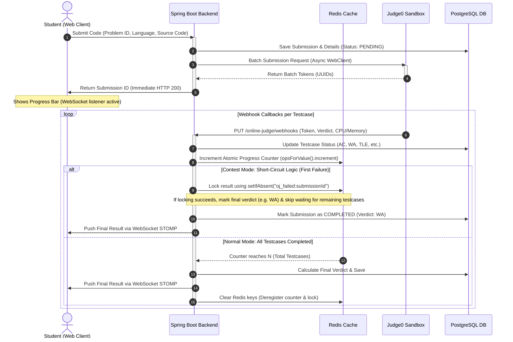
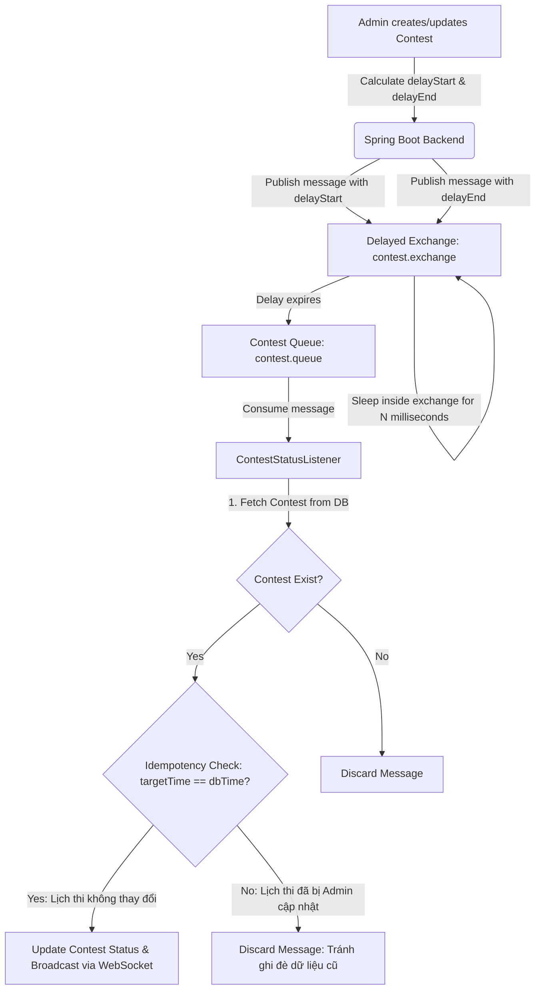
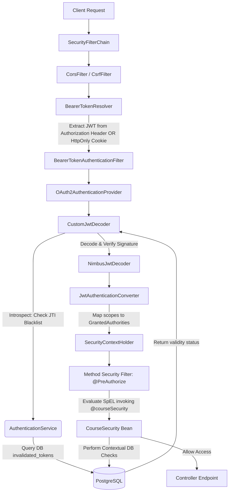

# CodeLearning Platform 🚀

<div align="center">
  <a href="https://www.codelearning.io.vn/" target="_blank">
    
  </a>

  <p align="center">
    <b>An enterprise-grade Full-Stack E-learning & Online Judge platform featuring automated multi-language code evaluation, real-time contest execution, and integrated financial transactions.</b>
  </p>

  <h3>🌐 Visit the Live Demo Website at: <a href="https://www.codelearning.io.vn/">www.codelearning.io.vn</a></h3>

  <br/>

  <!-- Frontend Badges -->
  [](https://react.dev/)
  [](https://www.typescriptlang.org/)
  [](https://vitejs.dev/)
  [](https://tailwindcss.com/)

  <!-- Backend & Infra Badges -->
  [](https://spring.io/projects/spring-boot)
  [](https://www.oracle.com/java/technologies/downloads/)
  [](https://www.postgresql.org/)
  [](https://redis.io/)
  [](https://www.rabbitmq.com/)
  [](https://www.docker.com/)
  [](https://payos.vn/)
</div>

An advanced **Full-Stack E-learning & Online Judge (OJ) platform** engineered with **Spring Boot 3.5.7**, **Java 21**, and **React 19**. It integrates automated code execution sandboxes, real-time status updates via WebSockets, event-driven contest scheduling, and secure payment processing.

Designed with enterprise-grade architectures (Layered Monolith, Monorepo, Event-Driven, Asynchronous execution), this project demonstrates practical solutions to high concurrency, resource management, performance optimization, and web application security.

---

## 🌟 Key Features

### ⚡ 1. Online Judge (Hệ thống Chấm bài Lập trình Tự động)
* **Monaco Code Editor**: Tích hợp IDE soạn thảo code mạnh mẽ (tương tự VS Code) hỗ trợ gợi ý code, highlight cú pháp cho nhiều ngôn ngữ (C++, Java, Python, JavaScript...).
* **Asynchronous Sandbox Evaluation (Judge0)**: Gửi code sang sandbox xử lý bất đồng bộ qua **Spring WebFlux** & Webhooks, kiểm tra chính xác từng testcase (`Accepted`, `Wrong Answer`, `TLE`, `MLE`, `Compile Error`).
* **Real-time Status Updates (WebSocket STOMP)**: Cập nhật kết quả chấm bài tức thì từ server về client qua kết nối WebSocket mà không cần reload trang.
* **Ngắt mạch chấm nhanh (Short-Circuit Logic)**: Tự động dừng chấm và trả về kết quả ngay khi gặp testcase thất bại đầu tiên, giúp tối ưu tài nguyên sandbox trong các kỳ thi.

### 💳 2. Cart & Payment Gateway (Giỏ hàng & Thanh toán PayOS)
* **Quản lý Giỏ hàng & Đơn hàng**: Thêm nhiều khóa học vào giỏ, áp dụng mã giảm giá/voucher và tạo đơn hàng checkout nhanh chóng.
* **Cổng thanh toán PayOS**: Tự động sinh mã QR ngân hàng động giúp người dùng chuyển khoản chính xác và tiện lợi.
* **Xử lý Giao dịch An toàn (Idempotency & Pessimistic Locking)**: Nhận callback webhook từ PayOS, áp dụng Postgres `SELECT FOR UPDATE` (`findByUserIdWithLock`) để cộng tiền/kích hoạt khóa học an toàn, chống race-condition.

### 🛡️ 3. Authentication & Security (Bảo mật & Phân quyền)
* **Đăng nhập Đa phương thức**: Hỗ trợ xác thực qua Email/Password và đăng nhập nhanh **Google OAuth2 Single Sign-On (SSO)**.
* **Cơ chế Token An toàn (JWT + RTR)**: Đọc JWT token linh hoạt từ `Authorization` Header hoặc `HttpOnly SameSite Cookie` (chống tấn công XSS/CSRF). Áp dụng **Refresh Token Rotation (RTR)** cấp mới pair token và thu hồi token cũ vào blacklist (`invalidated_tokens`).
* **Phân quyền Động (Dynamic RBAC & Contextual SpEL)**: Phân quyền theo vai trò (`STUDENT`, `INSTRUCTOR`, `ADMIN`) và kiểm soát truy cập sâu ở cấp phương thức (`@PreAuthorize`) bằng SpEL kiểm tra quyền sở hữu/đã đăng ký khóa học trước khi cho phép xem bài học.

---

## 🗺️ System Architecture

### 1. Asynchronous Webhook-Driven Online Judge (OJ) Flow
To prevent blocking main application threads during long-running code evaluation in the sandbox, the evaluation process is decoupled into a non-blocking asynchronous flow using **Spring WebFlux (WebClient)**, **Redis Atomic Counter**, and **WebSocket (STOMP)**.



---

### 2. Event-Driven Contest Scheduler (RabbitMQ Delayed Message Exchange)
Instead of resource-heavy database polling (cron-jobs executing every minute), the platform utilizes **RabbitMQ with the Delayed Message Exchange plugin** to trigger precise state changes for contests (*Upcoming → Running → Ended*).



---

### 3. Security Architecture & Dynamic Authorization
The security subsystem is built around **Spring Security** configured as an **OAuth2 Resource Server** with token verification against a token blacklist.



---

## ⚡ Technical Highlights & Best Practices

### 🚀 Performance & Optimization
* **Preventing N+1 Queries**: Utilized Spring Data JPA `@EntityGraph` (e.g., fetching categories and teacher assignments in `CourseRepository`) to load relationships in a single database query.
* **Database-Level Existence Verification**: Replaced heavy ORM entity loading with native `EXISTS` SQL queries (e.g., checking if a user has enrolled in a course or holds permissions to view a lesson) to stop DB index scanning on the first match.
* **Memory-Efficient Collection Mapping**: Mapped `@ManyToMany` and `@OneToMany` relationships using `Set` instead of `List` to prevent Hibernate from executing bulk delete-and-insert commands on join tables during updates.
* **Interface-based Projections**: Used customized native query projections (`OjPracticeProblemProjection`) in paginated requests to retrieve only essential columns, bypassing the overhead of loading bulky content columns like source code.

### 🛡️ Security & Integrity
* **Secure Authentication Delivery**: Configured custom `BearerTokenResolver` to read JWT tokens from both the standard `Authorization` header and secure `HttpOnly`, `SameSite` cookies (mitigating XSS attacks).
* **Refresh Token Rotation (RTR)**: Implemented token reuse prevention. When calling `/auth/refresh`, the previous refresh token is immediately pushed into a database blacklist (`invalidated_tokens`), and a new pair is issued.
* **Concurrency Control (Pessimistic Locking)**: Applied Postgres `SELECT FOR UPDATE` (`findByUserIdWithLock`) during wallet balance modifications (e.g., purchasing courses, webhook transaction updates) to prevent race conditions.
* **Contextual Method Security**: Implemented Method-level security annotations (`@PreAuthorize` with SpEL) invoking custom Spring security beans (`@courseSecurity.canAccessProblem(...)`) to dynamically authorize resource access.

---

## 🛠️ Tech Stack & Dependencies

| Layer | Technology / Library |
| :--- | :--- |
| **Frontend Framework** | React 19, TypeScript 5, Vite 6 |
| **UI & Styling** | Tailwind CSS v4, Framer Motion, Lucide Icons |
| **Code Editor & Tools** | `@monaco-editor/react`, Axios, i18next |
| **Realtime Communication** | SockJS-client, STOMPjs (WebSockets) |
| **Backend Framework** | Java 21, Spring Boot 3.5.7 (WebFlux, OAuth2 Resource Server, Data JPA) |
| **Database & Caching** | PostgreSQL 15, Redis 7 |
| **Message Broker** | RabbitMQ 3 (with `rabbitmq_delayed_message_exchange` plugin) |
| **Sandbox Engine** | Judge0 API v1.13.1 Sandbox |
| **Integrations** | PayOS SDK (Payment Gateway), Cloudinary (Media Hosting) |
| **DevOps & Containers** | Docker, Docker Compose (Dev/Prod Profiles), NGINX |

---

## 📂 Monorepo Project Structure

```text
codelearning-platform/
├── backend/                      # Spring Boot 3.5.7 Backend Application
│   ├── src/main/java/com/thanhmila/codelearning/
│   │   ├── configuration/        # Bean configs (Redis, RabbitMQ, WebClient, PayOS, etc.)
│   │   ├── controller/           # REST Controllers (Auth, Course, Contest, OJ, Payment, User)
│   │   ├── dto/                  # Data Transfer Objects
│   │   ├── entity/               # JPA Entities mapped to PostgreSQL
│   │   ├── exception/            # Global Exception Handlers
│   │   ├── listener/             # RabbitMQ Queue Consumers
│   │   ├── repository/           # Spring Data JPA Repositories (Projections, Specifications)
│   │   ├── security/             # Security configs, Custom JWT Decoder & SpEL Evaluators
│   │   └── service/              # Core Business Logic Services
│   ├── Dockerfile                # Multi-stage Dockerfile for Backend
│   ├── Dockerfile.rabbitmq       # RabbitMQ Dockerfile with Delayed Exchange plugin
│   └── pom.xml                   # Maven dependencies
├── frontend/                     # React 19 + TypeScript + Vite Frontend Application
│   ├── src/
│   │   ├── api/                  # Axios API Clients & Endpoints
│   │   ├── components/           # Reusable UI Components (Monaco Editor, Modals, Navbar)
│   │   ├── pages/                # Page Components (Home, OJ, Courses, Contest, Cart, Admin)
│   │   ├── context/              # React Context (Auth, Theme, Cart)
│   │   └── layouts/              # Main App & Dashboard Layouts
│   ├── Dockerfile                # NGINX Container Dockerfile
│   └── package.json              # Node.js dependencies
├── database/                     # Database Initialization Scripts
│   └── init.sql                  # PostgreSQL Schema & Seed Data
├── docs/                         # Detailed System Architecture & Workflow Specs
│   ├── project_analysis_report.md
│   ├── workflow_judge0.md
│   ├── generation_testcase_automation.md
│   ├── rabbitmq_contest_status_workflow.md
│   └── workflow_cart_payment.md
├── docker-compose.dev.yml        # Orchestration for Development Environment
├── docker-compose.prod.yml       # Orchestration for Production Environment
├── judge0.conf                   # Judge0 Sandbox Configuration
└── README.md                     # Monorepo Documentation
```

---

## 🚀 Getting Started & Local Setup

### 📋 Prerequisites
Ensure you have the following installed on your machine:
* [Docker & Docker Compose](https://www.docker.com/)
* [JDK 21](https://www.oracle.com/java/technologies/downloads/) (Optional for manual backend run)
* [Node.js 20+](https://nodejs.org/) & `npm` (Optional for manual frontend run)

---

### 1. Environment Variables Setup

#### Backend Environment (`backend/.env`):
Create a `.env` file in the `backend/` directory:
```env
# SERVER CONFIG
PORT=8080
ALLOWED_ORIGINS=http://localhost:3000,http://localhost:5173

# POSTGRES DB
DB_HOST=localhost
DB_PORT=5432
DB_NAME=codelearning
DB_USERNAME=postgres
DB_PASSWORD=your_secure_password

# REDIS
REDIS_HOST=localhost
REDIS_PORT=6379

# RABBITMQ
RABBITMQ_HOST=localhost
RABBITMQ_PORT=5672
RABBITMQ_USERNAME=guest
RABBITMQ_PASSWORD=guest

# SECURITY (JWT)
JWT_SIGNER_KEY=your_super_secret_32_characters_key_here
JWT_ACCESS_COOKIE_NAME=access_token
JWT_REFRESH_COOKIE_NAME=refresh_token

# THIRD-PARTY INTEGRATIONS
CLOUDINARY_CLOUD_NAME=your_cloudinary_name
CLOUDINARY_API_KEY=your_cloudinary_key
CLOUDINARY_API_SECRET=your_cloudinary_secret

PAYOS_CLIENT_ID=your_payos_client_id
PAYOS_API_KEY=your_payos_api_key
PAYOS_CHECKSUM_KEY=your_payos_checksum_key

# JUDGE0 (OJ SANDBOX)
JUDGE0_API_URL=http://localhost:2358
JUDGE0_WEBHOOK_URL=http://your-public-ip-or-ngrok/online-judge/webhooks/submissions
```

#### Frontend Environment (`frontend/.env`):
Create a `.env` file in the `frontend/` directory:
```env
VITE_API_BASE_URL=http://localhost:8080
VITE_GOOGLE_CLIENT_ID=your_google_oauth_client_id
```

---

### 2. Run via Docker Compose (Recommended)

Run all services (Database, Redis, RabbitMQ, Judge0 Sandbox, Backend, and Frontend) using Docker Compose profiles:

#### Development Environment:
```bash
docker compose -f docker-compose.dev.yml --profile backend --profile frontend --profile judge0 up -d
```

#### Production Environment:
```bash
docker compose -f docker-compose.prod.yml --profile backend --profile frontend --profile judge0 up -d
```

> [!NOTE]
> Docker Compose is configured with `healthchecks`. Services will start in order, waiting for PostgreSQL, Redis, and RabbitMQ to become healthy before launching the Spring Boot Backend and React Frontend.

---

### 3. Manual Local Execution (Alternative)

#### A. Run Infrastructure Dependencies Only:
```bash
docker compose -f docker-compose.dev.yml up -d db redis rabbitmq judge0-server judge0-workers judge0-db judge0-redis
```

#### B. Start Backend (Spring Boot):
```bash
cd backend
mvn clean package -DskipTests
mvn spring-boot:run
```
Backend will start at `http://localhost:8080`.

#### C. Start Frontend (Vite + React):
```bash
cd frontend
npm install
npm run dev
```
Frontend will be available at `http://localhost:5173`.

---

## 📚 Detailed System Documentation & Design Specs

For in-depth analysis and workflow specifications of individual subsystems, refer to the documents in the [/docs](docs) directory:
* [📄 Architectural Review & Security Audit](docs/project_analysis_report.md) - System architecture design decisions, bottlenecks & solutions.
* [🔌 Online Judge (OJ) Integration Specification](docs/workflow_judge0.md) - Deep dive into Judge0 sandbox communication & Webhook handling.
* [⚙️ Testcase Automation Engine Workflow](docs/generation_testcase_automation.md) - Auto-generation of test inputs & expected outputs via sandbox.
* [⏱️ RabbitMQ Delayed Contest Scheduling](docs/rabbitmq_contest_status_workflow.md) - Reliable scheduled updates using RabbitMQ delayed exchanges.
* [💳 Cart, Orders & PayOS Wallet Ledger](docs/workflow_cart_payment.md) - Financial transaction ledger, cart processing, and PayOS integration.

---

## 👩‍💻 Author

* **Võ Ngọc Thanh (Thanh_MiLa)** - [GitHub Profile](https://github.com/ThanhMiLa)
* **Role:** Full-Stack & System Engineer
