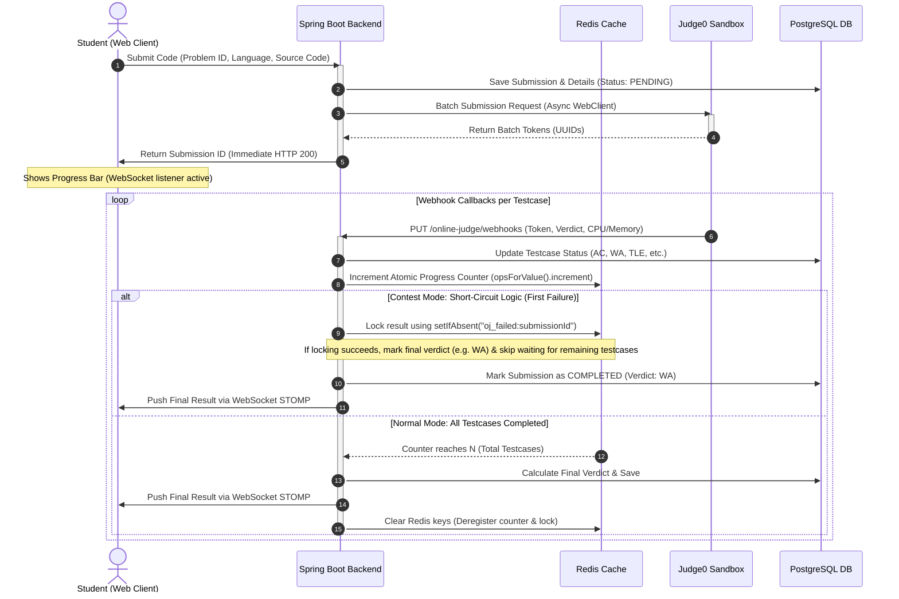
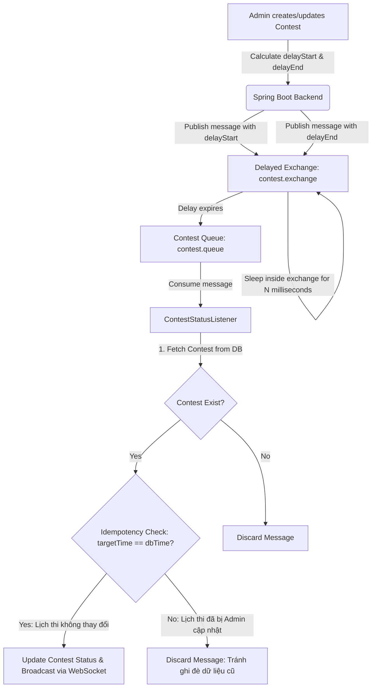
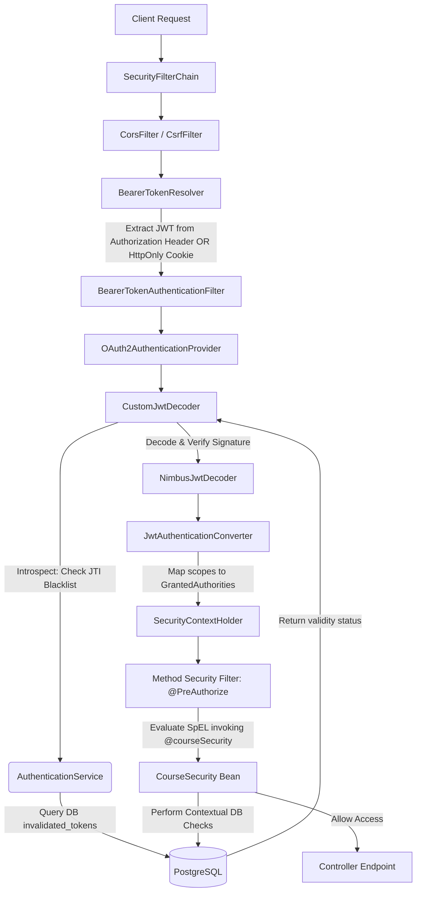

# CodeLearning Platform 🚀

<div align="center">
  <a href="https://www.codelearning.io.vn/" target="_blank">
    
  </a>
  
  <p align="center">
    <b>An advanced E-learning & Online Judge platform featuring automated code evaluation, real-time status updates, and interactive programming contest management.</b>
  </p>
  
  <h3>🌐 Visit the Live Demo Website at: <a href="https://www.codelearning.io.vn/">www.codelearning.io.vn</a></h3>

  <br/>

  [](https://spring.io/projects/spring-boot)
  [](https://www.oracle.com/java/technologies/downloads/)
  [](https://www.postgresql.org/)
  [](https://redis.io/)
  [](https://www.rabbitmq.com/)
  [](https://www.docker.com/)
  [](https://payos.vn/)
</div>

An advanced **E-learning & Online Judge (OJ) platform** backend engineered with **Spring Boot 3.5.7** and **Java 21**. It integrates automated code execution sandboxes, real-time status updates, event-driven contest scheduling, and secure financial transactions.

Designed with enterprise-grade architectures (Layered Monolith, Event-Driven, Asynchronous execution), this project demonstrates practical solutions to concurrency, resource management, performance optimization, and application security.

---

## 🗺️ System Architecture

### 1. Asynchronous Webhook-Driven Online Judge (OJ) Flow
To prevent blocking main application threads during long-running code evaluation in the sandbox, the evaluation process is decoupled into a non-blocking asynchronous flow using **Spring WebFlux (WebClient)**, **Redis Atomic Counter**, and **WebSocket (STOMP)**.



---

### 2. Event-Driven Contest Scheduler (RabbitMQ Delayed Message Exchange)
Instead of resource-heavy database polling (cron-jobs executing every minute), the platform utilizes **RabbitMQ with the Delayed Message Exchange plugin** to trigger precise state changes for contests (*Upcoming → Running → Ended*).



---

### 3. Security Architecture & Dynamic Authorization
The security subsystem is built around **Spring Security** configured as an **OAuth2 Resource Server** with token verification against a token blacklist.



---

## ⚡ Technical Highlights & Best Practices

### 🚀 Performance & Optimization
*   **Preventing N+1 Queries**: Utilized Spring Data JPA `@EntityGraph` (e.g., fetching categories and teacher assignments in [CourseRepository](src/main/java/com/thanhmila/codelearning/repository/course/CourseRepository.java)) to load relationships in a single database query.
*   **Database-Level Existence Verification**: Replaced heavy ORM entity loading with native `EXISTS` SQL queries (e.g., checking if a user has enrolled in a course or holds permissions to view a lesson) to stop DB index scanning on the first match.
*   **Memory-Efficient Collection Mapping**: Mapped `@ManyToMany` and `@OneToMany` relationships using `Set` instead of `List` to prevent Hibernate from executing bulk delete-and-insert commands on join tables during updates.
*   **Interface-based Projections**: Used customized native query projections ([OjPracticeProblemProjection](src/main/java/com/thanhmila/codelearning/repository/oj/OjPracticeProblemProjection.java)) in paginated requests to retrieve only essential columns (e.g., statistics, titles), bypassing the overhead of loading bulky content columns like source code.

### 🛡️ Security & Integrity
*   **Secure Authentication Delivery**: Configured custom `BearerTokenResolver` to read JWT tokens from both the standard `Authorization` header (for mobile/external clients) and secure `HttpOnly`, `SameSite` cookies (for web clients to mitigate XSS attacks).
*   **Refresh Token Rotation (RTR)**: Implemented token reuse prevention. When calling `/auth/refresh`, the previous refresh token is immediately pushed into a database blacklist (`invalidated_tokens`), and a new pair is issued, mitigating replay attacks.
*   **Concurrency Control (Pessimistic Locking)**: Applied Postgres `SELECT FOR UPDATE` (`findByUserIdWithLock`) during wallet balance modifications (e.g., purchasing courses, webhook transaction updates) to prevent race conditions on balance deductions.
*   **Contextual Method Security**: Implemented Method-level security annotations (`@PreAuthorize` with SpEL) invoking custom Spring security beans (`@courseSecurity.canAccessProblem(...)`) to dynamically authorize resource access before controller entry.

---

## 🛠️ Tech Stack & Dependencies

*   **Language & Runtime:** Java 21 (Virtual Threads support ready), Kotlin (Helper build plugin).
*   **Core Framework:** Spring Boot 3.5.7 (Spring Web, Spring Security OAuth2 Resource Server, Spring Data JPA, Spring WebFlux).
*   **Message Broker:** RabbitMQ 3 (with `rabbitmq_delayed_message_exchange` plugin).
*   **Caching & Concurrency Control:** Redis (Spring Data Redis, StringRedisTemplate).
*   **Database:** PostgreSQL 15.
*   **Utility & Mapping:** MapStruct 1.5.5, Lombok, Spotless.
*   **Integrations:** PayOS SDK (Payment Gateway), Cloudinary (Image/Video hosting), Judge0 Sandbox (Compiler Engine API).

---

## 📂 Project Structure

```text
codelearning/
├── src/main/java/com/thanhmila/codelearning/
│   ├── configuration/     # Beans configurations (Redis, RabbitMQ, WebClient, Websocket, PayOS, etc.)
│   ├── controller/        # REST APIs Controllers mapped by business domains
│   │   ├── auth/          # Authentication & Token rotation endpoints
│   │   ├── contest/       # Competitive Coding Contests endpoints
│   │   ├── course/        # Courses, Chapters, Lessons, and Quizzes endpoints
│   │   ├── oj/            # Online Judge submission & problem endpoints
│   │   └── payment/       # Cart, Orders, and Wallet endpoints
│   ├── dto/               # Data Transfer Objects (Requests & Responses payload)
│   ├── entity/            # JPA Entities mapped to PostgreSQL schemas
│   ├── event/             # Internal Application Events (Spring Events)
│   ├── exception/         # Centralized Global Exception Handlers
│   ├── listener/          # Message queue consumers (RabbitMQ listeners)
│   ├── mapper/            # MapStruct interfaces for Entity-to-DTO conversions
│   ├── repository/        # Spring Data JPA Repository layer (Specifications, Projections)
│   ├── security/          # Spring Security configs, custom JWT decoder & SpEL evaluators
│   ├── service/           # Business Logic layer (OJ processing, Payments, Contests scheduling)
│   └── util/              # Shared helper functions
├── db/                    # DB schema initialization scripts
├── docs/                  # Detailed system design documents & workflows
├── docker-compose.yml     # Complete orchestration (Web App, DB, Redis, RabbitMQ, Judge0 Sandbox)
├── Dockerfile.rabbitmq    # RabbitMQ Dockerfile with pre-installed delay exchange plugin
└── pom.xml                # Maven dependencies and compilation plugins
```

---

## 🚀 Getting Started & Local Setup

### 📋 Prerequisites
Make sure you have installed:
*   [Docker & Docker Compose](https://www.docker.com/)
*   [JDK 21](https://www.oracle.com/java/technologies/downloads/)
*   [Maven 3.9+](https://maven.apache.org/)

### 1. Configure Environment Variables
Create a `.env` file in the root directory and configure the environment variables:
```env
# SERVER CONFIG
PORT=8080
ALLOWED_ORIGINS=http://localhost:3000,http://localhost:5173

# POSTGRES
DB_HOST=localhost
DB_PORT=5432
DB_NAME=codelearning
DB_USERNAME=postgres
DB_PASSWORD=your_secure_password

# REDIS
REDIS_HOST=localhost
REDIS_PORT=6379

# RABBITMQ
RABBITMQ_HOST=localhost
RABBITMQ_PORT=5672
RABBITMQ_USERNAME=guest
RABBITMQ_PASSWORD=guest

# SECURITY (JWT)
JWT_SIGNER_KEY=your_super_secret_32_characters_key_here
JWT_ACCESS_COOKIE_NAME=access_token
JWT_REFRESH_COOKIE_NAME=refresh_token

# THIRD PARTY INTEGRATION
CLOUDINARY_CLOUD_NAME=your_cloudinary_name
CLOUDINARY_API_KEY=your_cloudinary_key
CLOUDINARY_API_SECRET=your_cloudinary_secret

PAYOS_CLIENT_ID=your_payos_client_id
PAYOS_API_KEY=your_payos_api_key
PAYOS_CHECKSUM_KEY=your_payos_checksum_key

# JUDGE0 (OJ SANDBOX)
JUDGE0_API_URL=http://localhost:2358
JUDGE0_WEBHOOK_URL=http://your-public-ip-or-ngrok/online-judge/webhooks/submissions
```

### 2. Run Local Infrastructure via Docker Compose
We orchestrate the entire environment (including RabbitMQ with plugins, Redis, PostgreSQL, and the full Judge0 Sandbox stack) with a single command:
```bash
docker-compose up -d
```
> [!NOTE]
> The `docker-compose.yml` is configured with `healthchecks`. Backend-dependent services will wait to start until PostgreSQL, Redis, and RabbitMQ container statuses are reported as `healthy`.

### 3. Build & Run the Spring Boot App
Navigate to the project root and run the application:
```bash
# Build the project
mvn clean package -DskipTests

# Run the Spring Boot application
mvn spring-boot:run
```
The server will start at `http://localhost:8080`. You can test APIs using tools like Postman.

---

## 📚 Detailed System Workflows & Design Documents
For deep-dive documentation on specific subsystems, refer to the documents inside the `/docs` directory:
*   [📄 Architectural Review & Security Audit](docs/project_analysis_report.md) - Analysis of design decisions, bottlenecks, and solutions.
*   [🔌 Online Judge (OJ) Integration Detail](docs/workflow_judge0.md) - Deep dive into Judge0 sandbox communication.
*   [⚙️ Testcase Automation Engine Flow](docs/generation_testcase_automation.md) - Auto-generating inputs & expected outputs via sandbox.
*   [⏱️ RabbitMQ Delayed Contest Scheduling](docs/rabbitmq_contest_status_workflow.md) - Reliable scheduled updates using delayed exchange.
*   [💳 Cart, Checkout & PayOS Wallet Ledger](docs/workflow_cart_payment.md) - Wallet, cart processing, and transaction ledger logging.

---

## 👩‍💻 Author
*   **Võ Ngọc Thanh (Thanh_MiLa)** - [GitHub Profile](https://github.com/ThanhMiLa)
*   **Role:** Java Backend Developer
