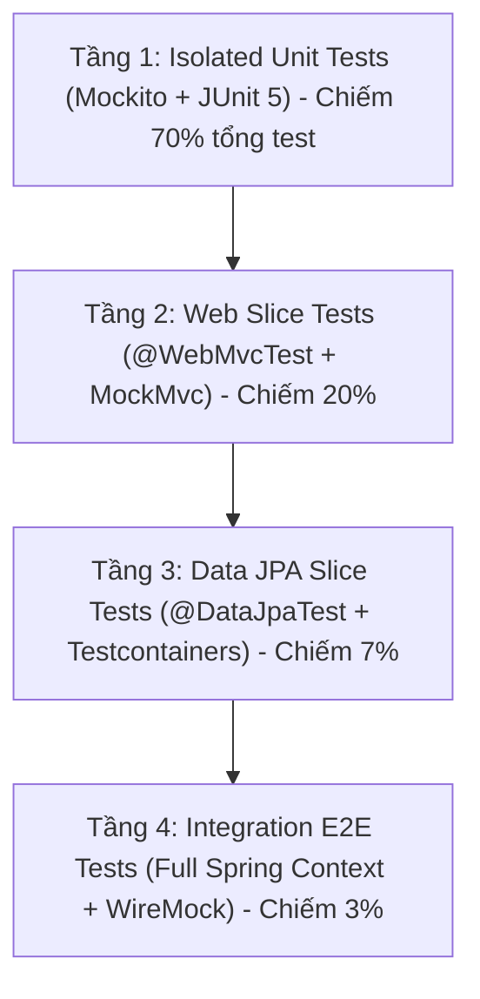

# 🏛️ KẾ HOẠCH TỔNG THỂ & TIÊU CHUẨN KIỂM THỬ (MASTER TEST STRATEGY)
Dự án: **CodeLearning Platform Backend**  
Phiên bản: **Spring Boot 3.5.7 - Java 21**  
Vị trí tài liệu: `backend/docs/plan_test/00_MASTER_TEST_STRATEGY_AND_STANDARDS.md`

---

## 1. Mục tiêu & Nguyên tắc cốt lõi

### 1.1. Mục tiêu chất lượng (Quality Goals)
* **Độ bao phủ dòng lệnh (Line Coverage):** $\ge 90\%$ trên toàn bộ tầng Service, Controller, Security, Listener, Util, Exception.
* **Độ bao phủ rẽ nhánh (Branch Coverage):** $\ge 85\%$ (Mục tiêu 100% cho các luồng thanh toán, tính điểm ICPC, kiểm tra quyền và máy chấm OJ).
* **Độ tin cậy (Reliability):** 100% tests phải chạy độc lập, idempotent, không phụ thuộc thứ tự chạy, không phụ thuộc Internet hoặc máy chủ thật bên ngoài.
* **Tốc độ thực thi (Speed):** Toàn bộ Unit Test suite ($\approx 300+$ tests) phải hoàn thành trong thời gian dưới 15 giây.

### 1.2. Kim tự tháp kiểm thử (Testing Pyramid)


1. **Tầng 1 - Pure Unit Tests (Isolated):**
   * Đối tượng: Toàn bộ các Service (`*Service.java`), Utilities (`*Utils.java`), Custom Security Beans (`CourseSecurity.java`), Exception Handlers (`GlobalExceptionHandler.java`).
   * Đặc điểm: Chạy bằng `MockitoExtension`, không khởi động Spring Context. Mock tất cả các Repositories, RedisTemplate, RabbitTemplate, WebClient, SimpMessagingTemplate, ApplicationEventPublisher.
   * Nhiệm vụ: Xử lý mọi nhánh logic rẽ nhánh (`if-else`, `switch`, `try-catch`, `orElseThrow`, `stream filter`).

2. **Tầng 2 - Web Slice Tests (`@WebMvcTest`):**
   * Đối tượng: Các REST Controller (`*Controller.java`).
   * Đặc điểm: Chỉ khởi động Web Context, Mock các Service bằng `@MockBean` (hoặc `@MockitoBean`).
   * Nhiệm vụ: Kiểm tra HTTP Status Codes, serialize/deserialize JSON, Bean Validation (`@Valid`, `@NotBlank`, `@Size`), HttpOnly cookies, mapping lỗi từ ExceptionHandler.

3. **Tầng 3 - Data Slice Tests (`@DataJpaTest`):**
   * Đối tượng: Các Repository có câu query phức tạp, native SQL, projections, specifications (`CourseSpecification`, `ProblemSpecification`, `OjPracticeProblemProjection`).
   * Đặc điểm: Chạy cùng PostgreSQL container thật thông qua Testcontainers.

4. **Tầng 4 - Integration E2E Tests:**
   * Đối tượng: Luồng tương tác liên module: Đăng ký -> Nộp bài OJ -> Nhận Webhook -> Cập nhật Leaderboard. Giả lập PayOS và Judge0 qua WireMock.

---

## 2. Cấu hình Công nghệ & Thư viện Test

### 2.1. Cập nhật `backend/pom.xml`
Bổ sung các dependency và plugin sau vào `backend/pom.xml`:

```xml
<!-- ========== TESTING LIBRARIES ========== -->
<dependencies>
    <!-- Core Spring Boot Test (JUnit 5, Mockito, AssertJ, MockMvc, JSONPath) -->
    <dependency>
        <groupId>org.springframework.boot</groupId>
        <artifactId>spring-boot-starter-test</artifactId>
        <scope>test</scope>
    </dependency>

    <!-- Spring Security Test (Giả lập @WithMockUser, JWT, CSRF) -->
    <dependency>
        <groupId>org.springframework.security</groupId>
        <artifactId>spring-security-test</artifactId>
        <scope>test</scope>
    </dependency>

    <!-- WireMock: Giả lập HTTP Server bên ngoài (Judge0, PayOS, SendGrid) -->
    <dependency>
        <groupId>org.wiremock</groupId>
        <artifactId>wiremock-standalone</artifactId>
        <version>3.10.0</version>
        <scope>test</scope>
    </dependency>

    <!-- Awaitility: Kiểm thử tác vụ bất đồng bộ (@Async, RabbitMQ, Redis, Events) -->
    <dependency>
        <groupId>org.awaitility</groupId>
        <artifactId>awaitility</artifactId>
        <version>4.2.2</version>
        <scope>test</scope>
    </dependency>

    <!-- Instancio: Tự động sinh dữ liệu Dummy ngẫu nhiên cho Entity & DTO -->
    <dependency>
        <groupId>org.instancio</groupId>
        <artifactId>instancio-junit</artifactId>
        <version>5.3.0</version>
        <scope>test</scope>
    </dependency>

    <!-- Testcontainers (Dùng cho Tầng 3 & 4) -->
    <dependency>
        <groupId>org.testcontainers</groupId>
        <artifactId>postgresql</artifactId>
        <version>1.20.4</version>
        <scope>test</scope>
    </dependency>
    <dependency>
        <groupId>org.testcontainers</groupId>
        <artifactId>rabbitmq</artifactId>
        <version>1.20.4</version>
        <scope>test</scope>
    </dependency>
    <dependency>
        <groupId>org.testcontainers</groupId>
        <artifactId>junit-jupiter</artifactId>
        <version>1.20.4</version>
        <scope>test</scope>
    </dependency>
</dependencies>
```

### 2.2. Cấu hình JaCoCo Plugin trong `backend/pom.xml`
```xml
<build>
    <plugins>
        <!-- JaCoCo Code Coverage Plugin -->
        <plugin>
            <groupId>org.jacoco</groupId>
            <artifactId>jacoco-maven-plugin</artifactId>
            <version>0.8.12</version>
            <configuration>
                <excludes>
                    <!-- Loại trừ các class boilerplate khỏi báo cáo -->
                    <exclude>com/thanhmila/codelearning/CodelearningApplication.class</exclude>
                    <exclude>com/thanhmila/codelearning/configuration/**</exclude>
                    <exclude>com/thanhmila/codelearning/dto/**</exclude>
                    <exclude>com/thanhmila/codelearning/entity/**</exclude>
                    <exclude>com/thanhmila/codelearning/mapper/**</exclude>
                    <exclude>com/thanhmila/codelearning/event/**</exclude>
                </excludes>
            </configuration>
            <executions>
                <execution>
                    <id>prepare-agent</id>
                    <goals>
                        <goal>prepare-agent</goal>
                    </goals>
                </execution>
                <execution>
                    <id>report</id>
                    <phase>test</phase>
                    <goals>
                        <goal>report</goal>
                    </goals>
                </execution>
                <execution>
                    <id>check</id>
                    <goals>
                        <goal>check</goal>
                    </goals>
                    <configuration>
                        <rules>
                            <rule>
                                <element>BUNDLE</element>
                                <limits>
                                    <limit>
                                        <counter>LINE</counter>
                                        <value>COVEREDRATIO</value>
                                        <minimum>0.85</minimum>
                                    </limit>
                                    <limit>
                                        <counter>BRANCH</counter>
                                        <value>COVEREDRATIO</value>
                                        <minimum>0.80</minimum>
                                    </limit>
                                </limits>
                            </rule>
                        </rules>
                    </configuration>
                </execution>
            </executions>
        </plugin>
    </plugins>
</build>
```

### 2.3. Cấu hình `backend/lombok.config`
Bắt buộc phải có file `backend/lombok.config` để JaCoCo không tính các method do Lombok sinh tự động (`getters`, `setters`, `builder`, `equalsAndHashCode`):

```properties
config.stopBubbling = true
lombok.addLombokGeneratedAnnotation = true
```

---

## 3. Quy chuẩn viết Test (Testing Standards & Conventions)

### 3.1. Cấu trúc thư mục Test (`src/test/java`)
Cấu trúc package của `src/test/java` phải phản chiếu 100% `src/main/java`:

```text
src/test/java/com/thanhmila/codelearning/
├── controller/
│   ├── admin/
│   ├── auth/
│   ├── contest/
│   ├── course/
│   ├── oj/
│   └── payment/
├── exception/
│   └── GlobalExceptionHandlerTest.java
├── listener/
│   ├── ContestLeaderboardListenerTest.java
│   └── ContestStatusListenerTest.java
├── scheduler/
│   └── PaymentCronJobTest.java
├── security/
│   ├── CourseSecurityTest.java
│   └── CustomJwtDecoderTest.java
├── service/
│   ├── admin/
│   ├── auth/
│   ├── contest/
│   ├── course/
│   ├── email/
│   ├── oj/
│   ├── payment/
│   └── user/
└── util/
    └── ProgressUtilsTest.java
```

### 3.2. Quy tắc đặt tên (Naming Conventions)
* **Tên Class:** `<TargetClass>Test.java` (Ví dụ: `OrderServiceTest.java`, `AuthenticationControllerTest.java`).
* **Tên Method:** Tuân thủ mẫu `should<ExpectedBehavior>_When<StateUnderTest>()`.
  * *Ví dụ:* `shouldThrowInsufficientBalance_WhenWalletBalanceIsLessThanTotal()`
  * *Ví dụ:* `shouldSucceedCheckout_WhenAllValidationsPass()`
* **Sử dụng `@DisplayName` và `@Nested`:** Gom nhóm các kịch bản test theo từng method cần test để cấu trúc cây test rõ ràng trong IDE và báo cáo CI.

### 3.3. Cấu trúc một Test Case (AAA Pattern)
Mọi test case phải phân định rõ 3 giai đoạn:
1. **Arrange (Given):** Chuẩn bị dữ liệu đầu vào, thiết lập các kỳ vọng Mock (`when(...).thenReturn(...)`).
2. **Act (When):** Thực thi method cần kiểm thử.
3. **Assert (Then):** Kiểm tra kết quả trả về (`assertThat(...)`), kiểm tra Exception (`assertThatThrownBy(...)`), và xác nhận các lời gọi phụ thuộc (`verify(...)`).

---

## 4. Danh sách các Kế hoạch Kiểm thử Chi tiết (Module Plans)

Hệ thống được chia nhỏ thành các kế hoạch chi tiết độc lập sau:

| Plan File | Module | Trọng tâm kiểm thử |
| :--- | :--- | :--- |
| **`01_PLAN_AUTH_AND_USER_MODULE.md`** | Auth, User & Admin User | Đăng ký, đăng nhập JWT, Google OAuth, Đổi mật khẩu, Khóa/Mở khóa User, Token blacklist |
| **`02_PLAN_ONLINE_JUDGE_MODULE.md`** | Online Judge & Sandbox | Nộp bài, Judge0 batching, Redis atomic counter, Short-circuit contest lock, Webhook callback, Sinh testcase |
| **`03_PLAN_CONTEST_MODULE.md`** | Contests & ICPC Scoring | Vòng đời cuộc thi, RabbitMQ delayed message, Thuật toán ICPC Leaderboard, WebSocket broadcast |
| **`04_PLAN_COURSE_AND_LEARNING_MODULE.md`** | Course, Lesson & Quiz | Quản lý khóa học, tiến độ học tập, kiểm tra bài giảng dùng thử (trial), chấm trắc nghiệm |
| **`05_PLAN_PAYMENT_AND_WALLET_MODULE.md`** | Payment, Cart & Order | Thanh toán ví nội bộ, Pessimistic lock, PayOS HMAC-SHA256, Webhook idempotency, Late payment |
| **`06_PLAN_SECURITY_EXCEPTION_AND_INFRA_MODULE.md`** | Security, Exception, Email | `@courseSecurity` SpEL, JWT decoder, Bucket4j rate limiter, GlobalExceptionHandler, SendGrid webhook |
| **`07_PLAN_INTEGRATION_TESTS_AND_CI_CD.md`** | Integration & CI/CD | Testcontainers (PostgreSQL, RabbitMQ, Redis), WireMock, GitHub Actions CI Pipeline |
