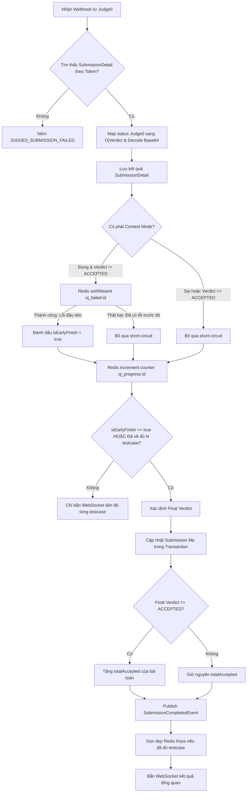

# 📋 KẾ HOẠCH KIỂM THỬ: ONLINE JUDGE (OJ) & SANDBOX MODULE
Dự án: **CodeLearning Platform**  
Module: **Online Judge Submissions, Problem Management & Testcase Generation**  
Vị trí tài liệu: `backend/docs/plan_test/02_PLAN_ONLINE_JUDGE_MODULE.md`  
Độ bao phủ mục tiêu: **Line Coverage $\ge 95\%$, Branch Coverage $\ge 90\%$**

---

## 1. Danh sách các Class trong phạm vi kiểm thử

| Thành phần | Đường dẫn file | Vai trò chính |
| :--- | :--- | :--- |
| **Service** | `service/oj/OjSubmissionService.java` | Tiếp nhận bài nộp, gửi Judge0 batch, xử lý Webhook chấm điểm, Redis counter, Short-circuit |
| **Service** | `service/oj/OnlineJudgeProblemService.java` | Tìm kiếm bài tập luyện tập, CRUD bài toán, lọc theo Tag/Độ khó |
| **Service** | `service/oj/OjTestcaseGenerationService.java` | Sinh testcase tự động qua Judge0, quản lý quy trình 2 pha (Input gen & Output gen) |
| **Service** | `service/oj/Judge0ClientService.java` | Client gọi WebClient sang Judge0 Sandbox |
| **Controller** | `controller/oj/OnlineJudgeSubmissionController.java` | Endpoint nộp bài, xem lịch sử và Webhook nhận kết quả |
| **Controller** | `controller/oj/OnlineJudgeProblemController.java` | Endpoint bài toán và sinh testcase |

---

## 2. Phân tích chi tiết Dòng lệnh & Rẽ nhánh (Line & Branch Coverage Analysis)

### 2.1. `OjSubmissionService.java`

#### Phương thức 1: `submitCode(OjSubmissionRequest request, Long userId)`
* **Nhánh 1 (User Validation):**
  * Nhánh 1.1: `userRepository.findById(userId)` trả về rỗng -> Ném `AppException(ErrorCode.USER_NOT_FOUND)`.
  * Nhánh 1.2: `user.validateStatus()` -> Ném ngoại lệ nếu user bị `LOCKED` hoặc `DISABLED`.
* **Nhánh 2 (Problem & Scope Validation):**
  * Nhánh 2.1: Bài toán không tồn tại hoặc `isPublic == false` -> Ném `AppException(ErrorCode.OJ_PROBLEM_NOT_FOUND)`.
  * Nhánh 2.2: `request.getContestId() != null` nhưng bài toán không nằm trong Contest (`existsByContestIdAndProblemId == false`) -> Ném `AppException(ErrorCode.OJ_PROBLEM_NOT_FOUND)`.
  * Nhánh 2.3: `request.getLessonId() != null` nhưng bài toán không thuộc Bài học (`existsByLessonIdAndProblemId == false`) -> Ném `AppException(ErrorCode.OJ_PROBLEM_NOT_FOUND)`.
* **Nhánh 3 (Testcase Availability):**
  * Nhánh 3.1: Bài toán chưa có testcase nào trong DB (`problemTestcaseEntityList.isEmpty()`) -> Ném `AppException(ErrorCode.TESTCASE_NOT_FOUND)`.
* **Nhánh 4 (Judge0 Batch Communication):**
  * Nhánh 4.1: `tokenList.isEmpty()` hoặc `tokenList.size() != problemTestcaseEntityList.size()` -> Ném `AppException(ErrorCode.JUDGE0_SUBMISSION_FAILED)`.
  * Nhánh 4.2 (Happy Path): Lưu `OnlineJudgeSubmissionEntity` (PENDING), tăng `totalSubmissions` của bài toán, lưu toàn bộ `OnlineJudgeSubmissionDetailEntity` tương ứng các token, trả về `submissionId`.
* **Nhánh 5 (Helper: `calculateTimeLimitForLanguage`):**
  * Nhánh 5.1: Java (Language ID = 62) -> Nhân hệ số 2.0.
  * Nhánh 5.2: Python (Language ID = 71) -> Nhân hệ số 3.0.
  * Nhánh 5.3: Ngôn ngữ khác (C++, C) -> Nhân hệ số 1.0.

---

#### Phương thức 2: `processJudge0Callback(Judge0CallbackPayload payload)`
Đây là phương thức cốt lõi với độ phức tạp rẽ nhánh cao nhất hệ thống:



* **Nhánh 1 (Token Verification):**
  * Nhánh 1.1: Token không tồn tại trong DB -> Ném `AppException(ErrorCode.JUDGE0_SUBMISSION_FAILED)`.
* **Nhánh 2 (Verdict Mapping & Base64 Decoding):**
  * Nhánh 2.1: Status ID = 3 -> `ACCEPTED`.
  * Nhánh 2.2: Status ID = 4 -> `WRONG_ANSWER`.
  * Nhánh 2.3: Status ID = 5 -> `TIME_LIMIT_EXCEEDED`.
  * Nhánh 2.4: Status ID = 6 -> `COMPILATION_ERROR`.
  * Nhánh 2.5: Status ID từ 7..12 -> `RUNTIME_ERROR`.
  * Nhánh 2.6: Base64 decode chuỗi null/rỗng -> trả về chuỗi rỗng `""`.
  * Nhánh 2.7: Base64 decode chuỗi bị lỗi định dạng -> bắt `IllegalArgumentException`, trả về raw string.
* **Nhánh 3 (Short-Circuit Logic - Contest Mode):**
  * Nhánh 3.1: `isContestMode == true` VÀ `testcaseVerdict != ACCEPTED`:
    * Nhánh 3.1a: `setIfAbsent(failedKey)` trả về `true` (Testcase lỗi đầu tiên về đích) -> `isEarlyFinish = true`.
    * Nhánh 3.1b: `setIfAbsent(failedKey)` trả về `false` (Đã có testcase khác phát hiện lỗi trước đó) -> `isEarlyFinish = false`.
  * Nhánh 3.2: `isContestMode == false` -> Không bao giờ kích hoạt short-circuit sớm.
* **Nhánh 4 (Redis Counter & Normal Finish):**
  * Nhánh 4.1: `processedCount == 1L` -> Thiết lập TTL 1 giờ cho key Redis.
  * Nhánh 4.2: `processedCount == totalTestcases` VÀ `hasKey(failedKey) == false` -> `isNormalFinish = true`.
* **Nhánh 5 (Finalize Verdict & Event Publishing):**
  * Nhánh 5.1: `isEarlyFinish == true` -> Final Verdict là lỗi của testcase hiện tại.
  * Nhánh 5.2: `isNormalFinish == true` -> Tìm testcase lỗi đầu tiên theo `orderIndex`. Nếu không có lỗi nào -> Final Verdict là `ACCEPTED`.
  * Nhánh 5.3: `finalOverallVerdict == ACCEPTED` -> Gọi `incrementTotalAccepted(problemId)`.
  * Nhánh 5.4: `finalOverallVerdict != ACCEPTED` -> Không tăng `totalAccepted`.
  * Nhánh 5.5: Phát tán `SubmissionCompletedEvent` (chứa `contestId` nếu là contest).
* **Nhánh 6 (Redis Cleanup):**
  * Nhánh 6.1: `processedCount == totalTestcases` -> Gọi `delete(redisKey)` và `delete(failedKey)`.
  * Nhánh 6.2: Chưa đủ testcase -> Giữ nguyên key trên Redis.

---

### 2.2. `OnlineJudgeProblemService.java`

* **`getPracticeProblems(ProblemSearchRequest request, Long userId)`:**
  * Nhánh 1: `keyword` có dữ liệu vs rỗng.
  * Nhánh 2: `tagIds` có dữ liệu vs rỗng.
  * Nhánh 3: `difficulties` có dữ liệu vs rỗng.
  * Nhánh 4: `userId != null` -> Truy vấn `findProblemIdsByUserIdAndProblemIdsAndVerdict` để đánh dấu bài nào đã `ACCEPTED` (`isAccepted = true/false`).
  * Nhánh 5: `userId == null` -> Toàn bộ `isAccepted = false`.
* **`createProblem(CreateOjProblemRequest request, Long userId)`:**
  * Nhánh 1: `teacherRepository.findIdByUserId(userId) == null` -> Ném `AppException(ErrorCode.ACCESS_DENIED)`.
  * Nhánh 2: Danh sách `tagIds` có ID không tồn tại -> Bỏ qua hoặc gán các tag hợp lệ.

---

### 2.3. `OjTestcaseGenerationService.java`

* **`generateTestcases(Long problemId, GenerateTestcaseRequest request)`:**
  * Nhánh 1: Bài toán không tồn tại -> `OJ_PROBLEM_NOT_FOUND`.
  * Nhánh 2: Xóa testcase cũ (`deleteByProblemId`).
  * Nhánh 3: Lưu mã nguồn generator và solution vào Redis.
  * Nhánh 4: Tạo N testcases với 2 testcase đầu `isHidden = false`, các testcase sau `isHidden = true`.
  * Nhánh 5: Gửi batch sang Judge0 và lưu token vào DB.

---

## 3. Ma trận Kịch bản Kiểm thử (Test Cases Matrix)

| Test ID | Method | Điều kiện đầu vào (Given) | Hành vi kỳ vọng (Then) |
| :--- | :--- | :--- | :--- |
| **OJ_SUB_01** | `submitCode` | User không tồn tại | Throws `AppException(USER_NOT_FOUND)` |
| **OJ_SUB_02** | `submitCode` | Problem không tồn tại hoặc private | Throws `AppException(OJ_PROBLEM_NOT_FOUND)` |
| **OJ_SUB_03** | `submitCode` | ContestId có giá trị nhưng Problem không thuộc Contest | Throws `AppException(OJ_PROBLEM_NOT_FOUND)` |
| **OJ_SUB_04** | `submitCode` | Bài toán chưa có testcase | Throws `AppException(TESTCASE_NOT_FOUND)` |
| **OJ_SUB_05** | `submitCode` | Judge0 trả về thiếu token | Throws `AppException(JUDGE0_SUBMISSION_FAILED)` |
| **OJ_SUB_06** | `submitCode` | Nộp bài hợp lệ (Ngôn ngữ Java) | TimeLimit nhân 2.0, lưu PENDING, trả về submissionId |
| **OJ_CB_01** | `processCallback` | Token không có trong DB | Throws `AppException(JUDGE0_SUBMISSION_FAILED)` |
| **OJ_CB_02** | `processCallback` | Normal Mode - Testcase 1/5 trả về WA | Detail lưu WA, counter = 1, chưa kết luận bài nộp |
| **OJ_CB_03** | `processCallback` | Normal Mode - Testcase 5/5 về đích, có 1 testcase WA | Chốt bài nộp = WA, xóa key Redis, publish event |
| **OJ_CB_04** | `processCallback` | Normal Mode - Toàn bộ 5/5 testcase AC | Chốt bài nộp = AC, tăng totalAccepted, xóa key Redis |
| **OJ_CB_05** | `processCallback` | Contest Mode - Testcase đầu tiên bị WA | `setIfAbsent` thành công -> Chốt bài nộp = WA ngay lập tức (Short-circuit) |
| **OJ_CB_06** | `processCallback` | Contest Mode - Testcase thứ 2 bị TLE (sau khi đã chốt WA) | `setIfAbsent` trả về false -> Không ghi đè kết quả chốt |

---

## 4. Test Blueprint Mẫu: `OjSubmissionServiceTest.java`

```java
package com.thanhmila.codelearning.service.oj;

import com.thanhmila.codelearning.dto.judge0.Judge0CallbackPayload;
import com.thanhmila.codelearning.dto.judge0.Judge0Status;
import com.thanhmila.codelearning.entity.enums.OjVerdict;
import com.thanhmila.codelearning.entity.enums.UserStatus;
import com.thanhmila.codelearning.entity.oj.OnlineJudgeProblemEntity;
import com.thanhmila.codelearning.entity.oj.OnlineJudgeSubmissionDetailEntity;
import com.thanhmila.codelearning.entity.oj.OnlineJudgeSubmissionEntity;
import com.thanhmila.codelearning.entity.oj.ProblemTestcaseEntity;
import com.thanhmila.codelearning.entity.user.UserEntity;
import com.thanhmila.codelearning.event.SubmissionCompletedEvent;
import com.thanhmila.codelearning.repository.oj.OnlineJudgeProblemRepository;
import com.thanhmila.codelearning.repository.oj.OnlineJudgeSubmissionDetailRepository;
import com.thanhmila.codelearning.repository.oj.OnlineJudgeSubmissionRepository;
import com.thanhmila.codelearning.repository.projection.SubmissionMaxStats;
import org.junit.jupiter.api.BeforeEach;
import org.junit.jupiter.api.DisplayName;
import org.junit.jupiter.api.Nested;
import org.junit.jupiter.api.Test;
import org.junit.jupiter.api.extension.ExtendWith;
import org.mockito.InjectMocks;
import org.mockito.Mock;
import org.mockito.junit.jupiter.MockitoExtension;
import org.springframework.context.ApplicationEventPublisher;
import org.springframework.data.redis.core.StringRedisTemplate;
import org.springframework.data.redis.core.ValueOperations;
import org.springframework.messaging.simp.SimpMessagingTemplate;
import org.springframework.transaction.support.TransactionCallback;
import org.springframework.transaction.support.TransactionTemplate;

import java.util.Optional;

import static org.assertj.core.api.Assertions.assertThat;
import static org.mockito.ArgumentMatchers.*;
import static org.mockito.Mockito.*;

@ExtendWith(MockitoExtension.class)
@DisplayName("OjSubmissionService Unit Tests")
class OjSubmissionServiceTest {

    @Mock OnlineJudgeSubmissionRepository onlineJudgeSubmissionRepository;
    @Mock OnlineJudgeSubmissionDetailRepository onlineJudgeSubmissionDetailRepository;
    @Mock OnlineJudgeProblemRepository onlineJudgeProblemRepository;
    @Mock StringRedisTemplate stringRedisTemplate;
    @Mock ValueOperations<String, String> valueOperations;
    @Mock SimpMessagingTemplate simpMessagingTemplate;
    @Mock ApplicationEventPublisher applicationEventPublisher;
    @Mock TransactionTemplate transactionTemplate;

    @InjectMocks OjSubmissionService ojSubmissionService;

    @BeforeEach
    void setUp() {
        lenient().when(stringRedisTemplate.opsForValue()).thenReturn(valueOperations);
        lenient().doAnswer(invocation -> {
            TransactionCallback<?> callback = invocation.getArgument(0);
            return callback.doInTransaction(null);
        }).when(transactionTemplate).executeWithoutResult(any());
    }

    @Nested
    @DisplayName("processJudge0Callback Branch Tests")
    class ProcessCallbackTests {

        @Test
        @DisplayName("Short-circuit in Contest Mode when first testcase fails")
        void shouldShortCircuit_WhenContestModeAndTestcaseFails() {
            String token = "token-123";
            Long submissionId = 100L;

            OnlineJudgeProblemEntity problem = OnlineJudgeProblemEntity.builder().id(1L).totalTestCase(5).build();
            UserEntity user = UserEntity.builder().id(2L).status(UserStatus.ACTIVE).build();
            com.thanhmila.codelearning.entity.contest.ContestEntity contest = 
                    com.thanhmila.codelearning.entity.contest.ContestEntity.builder().id(99L).build();

            OnlineJudgeSubmissionEntity submission = OnlineJudgeSubmissionEntity.builder()
                    .id(submissionId)
                    .problem(problem)
                    .user(user)
                    .contest(contest)
                    .build();

            ProblemTestcaseEntity testcase = ProblemTestcaseEntity.builder().id(50L).build();

            OnlineJudgeSubmissionDetailEntity detail = OnlineJudgeSubmissionDetailEntity.builder()
                    .id(10L)
                    .token(token)
                    .submission(submission)
                    .testcase(testcase)
                    .build();

            when(onlineJudgeSubmissionDetailRepository.findByTokenWithSubmissionAndProblem(token))
                    .thenReturn(Optional.of(detail));

            // Testcase bị Wrong Answer (Status ID = 4)
            Judge0CallbackPayload payload = new Judge0CallbackPayload();
            payload.setToken(token);
            payload.setStatus(new Judge0Status(4, "Wrong Answer"));
            payload.setTime("0.05");
            payload.setMemory(2048);

            // Redis: Lần đầu tiên thất bại -> setIfAbsent trả về true
            when(valueOperations.setIfAbsent(eq("oj_failed:" + submissionId), eq("1"), any())).thenReturn(true);
            when(valueOperations.increment("oj_progress:" + submissionId)).thenReturn(1L);

            SubmissionMaxStats maxStats = mock(SubmissionMaxStats.class);
            when(maxStats.getMaxTime()).thenReturn(50);
            when(maxStats.getMaxMemory()).thenReturn(2048);
            when(onlineJudgeSubmissionDetailRepository.findMaxStatsBySubmissionId(submissionId))
                    .thenReturn(Optional.of(maxStats));

            // Execute
            ojSubmissionService.processJudge0Callback(payload);

            // Assert
            assertThat(submission.getVerdict()).isEqualTo(OjVerdict.WRONG_ANSWER);
            verify(onlineJudgeSubmissionRepository).save(submission);
            verify(applicationEventPublisher).publishEvent(any(SubmissionCompletedEvent.class));
            verify(onlineJudgeProblemRepository, never()).incrementTotalAccepted(any());
            verify(simpMessagingTemplate, atLeastOnce()).convertAndSend(anyString(), any(Object.class));
        }
    }
}
```
