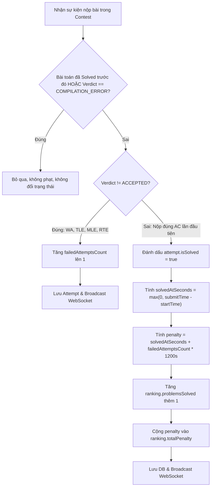

# 📋 KẾ HOẠCH KIỂM THỬ: CONTEST & ICPC SCORING MODULE
Dự án: **CodeLearning Platform**  
Module: **Contest Lifecycle, Delayed RabbitMQ Scheduler & ICPC Leaderboard**  
Vị trí tài liệu: `backend/docs/plan_test/03_PLAN_CONTEST_MODULE.md`  
Độ bao phủ mục tiêu: **Line Coverage $\ge 95\%$, Branch Coverage $\ge 90\%$**

---

## 1. Danh sách các Class trong phạm vi kiểm thử

| Thành phần | Đường dẫn file | Vai trò chính |
| :--- | :--- | :--- |
| **Service** | `service/contest/ContestService.java` | Quản lý vòng đời cuộc thi, phân quyền tạo/sửa, đăng ký thi, xếp thứ tự bài toán |
| **Service** | `service/contest/ContestLeaderboardService.java` | Thuật toán tính điểm phạt chuẩn ICPC, khởi tạo bảng xếp hạng, phát tín hiệu WebSocket |
| **Listener** | `listener/ContestStatusListener.java` | Consumer nhận message từ RabbitMQ Delayed Exchange để cập nhật trạng thái (START/END) |
| **Listener** | `listener/ContestLeaderboardListener.java` | Spring `@Async` Listener bắt `SubmissionCompletedEvent` và kích hoạt tính điểm |
| **Controller** | `controller/contest/ContestController.java` | Endpoint lấy danh sách thi, chi tiết bài thi, bảng xếp hạng |

---

## 2. Phân tích chi tiết Dòng lệnh & Rẽ nhánh (Line & Branch Coverage Analysis)

### 2.1. `ContestLeaderboardService.java`

#### Phương thức 1: `processIpcpLeaderboard(Long contestId, Long userId, Long problemId, OjVerdict verdict, ZonedDateTime submitTime)`
Thuật toán ICPC có các quy tắc nghiêm ngặt về tính điểm phạt và xử lý lần nộp:



* **Nhánh 1 (Lấy hoặc Tạo mới Attempt):**
  * Nhánh 1.1: `attemptRepo.findByContestIdAndUserIdAndProblemId` tìm thấy bản ghi có sẵn -> Sử dụng bản ghi đó.
  * Nhánh 1.2: Chưa có bản ghi -> Khởi tạo `ContestProblemAttemptEntity` mới với `isSolved = false`, `failedAttemptsCount = 0`.
* **Nhánh 2 (Quy tắc loại trừ ICPC):**
  * Nhánh 2.1: `verdict == OjVerdict.COMPILATION_ERROR` -> Return ngay, không tăng số lần sai.
  * Nhánh 2.2: `attempt.getIsSolved() == true` (User đã AC bài này trước đó rồi nhưng vẫn nộp tiếp) -> Return ngay, không làm thay đổi điểm số.
* **Nhánh 3 (Nộp sai - Incorrect Submissions):**
  * Nhánh 3.1: `verdict != ACCEPTED` (Ví dụ: `WRONG_ANSWER`, `TIME_LIMIT_EXCEEDED`, `MEMORY_LIMIT_EXCEEDED`, `RUNTIME_ERROR`):
    * Tăng `failedAttemptsCount` lên $1$.
    * Lưu attempt.
    * Gọi `broadcastLeaderboardUpdate(contestId, userId)`.
    * Return.
* **Nhánh 4 (Nộp đúng lần đầu tiên - First Accepted Solve):**
  * Nhánh 4.1: Tính `solvedAtSeconds`: Nếu `submitTime < startTime` (do lệch đồng hồ) -> Trả về `0`, ngược lại trả về số giây chênh lệch.
  * Nhánh 4.2: Đánh dấu `attempt.setIsSolved(true)` và `attempt.setSolvedAtSeconds(solvedAtSeconds)`.
  * Nhánh 4.3: Tính điểm phạt cho bài này: $\text{penalty} = \text{solvedAtSeconds} + (\text{failedAttemptsCount} \times 1200)$.
  * Nhánh 4.4: Ranking chưa tồn tại -> Tạo mới; Đã tồn tại -> Cộng dồn:
    * `problemsSolved = problemsSolved + 1`
    * `totalPenalty = totalPenalty + penalty`
  * Nhánh 4.5: Broadcast WebSocket chủ đề `/topic/contests/{contestId}/leaderboard`.

#### Phương thức 2: `initializeLeaderboardForUser(Long contestId, Long userId)`
* **Nhánh 1:** Contest không tồn tại -> `CONTEST_NOT_FOUND`.
* **Nhánh 2:** User không tồn tại -> `USER_NOT_FOUND`.
* **Nhánh 3:** Ranking đã tồn tại -> Không lưu mới; Chưa tồn tại -> Lưu `ContestRankingEntity` ban đầu (0 solved, 0 penalty).
* **Nhánh 4:** Lặp qua danh sách bài toán: Bài nào chưa có Attempt -> Thêm vào danh sách `newAttempts` và gọi `attemptRepo.saveAll(newAttempts)`.

---

### 2.2. `ContestService.java`

#### Phương thức 1: `createContest(ContestCreateRequest request, Long userId)`
* **Nhánh 1:** `request.getStartTime().isAfter(request.getEndTime())` hoặc bằng nhau -> `AppException(ErrorCode.INVALID_REQUEST)`.
* **Nhánh 2:** User không phải Teacher (`teacherId == null`) -> `AppException(ErrorCode.ACCESS_DENIED)`.
* **Nhánh 3:** Password có truyền (`StringUtils.hasText`) -> Hash bằng BCrypt; không truyền -> Gán `null` (Public Contest).
* **Nhánh 4 (RabbitMQ Delayed Messages):**
  * Gửi message `START` với delay = `startTime - now`.
  * Gửi message `END` với delay = `endTime - now`.

#### Phương thức 2: `updateContest(Long contestId, ContestUpdateRequest request, Long userId)`
* **Nhánh 1:** Contest không tồn tại -> `CONTEST_NOT_FOUND`.
* **Nhánh 2:** Teacher không phải người tạo (`contest.getCreatedByTeacher().getId() != teacherId`) -> `ACCESS_DENIED`.
* **Nhánh 3:** `startTime.isAfter(endTime)` -> `INVALID_REQUEST`.
* **Nhánh 4 (Đổi mật khẩu cuộc thi):**
  * Nhánh 4.1: Contest đang Private mà `oldPassword` rỗng hoặc sai hash -> `CONTEST_PASSWORD_INVALID`.
  * Nhánh 4.2: `newPassword` có giá trị -> Mã hóa mới; rỗng -> Đặt thành `null` (chuyển sang Public).
* **Nhánh 5 (Thay đổi thời gian thi):**
  * Nhánh 5.1: `endTime < now` -> Trạng thái thành `ENDED`.
  * Nhánh 5.2: `startTime > now` -> Trạng thái thành `UPCOMING`.
  * Nhánh 5.3: `startTime <= now <= endTime` -> Trạng thái thành `RUNNING`.
  * Gửi lại message delay RabbitMQ mới cho cả START và END.

#### Phương thức 3: `registerContest(Long contestId, ContestRegisterRequest request, Long userId)`
* **Nhánh 1:** Contest không tồn tại -> `CONTEST_NOT_FOUND`.
* **Nhánh 2:** Cuộc thi đã kết thúc -> `AppException(ErrorCode.CONTEST_ALREADY_STARTED)`.
* **Nhánh 3:** Cuộc thi có mật khẩu:
  * Nhánh 3a: Request không truyền pass hoặc pass sai -> `CONTEST_PASSWORD_INVALID`.
  * Nhánh 3b: Pass đúng -> Cho phép đăng ký.
* **Nhánh 4:** Cuộc thi công khai (không pass) -> Đăng ký thành công.
* **Nhánh 5:** Gọi `contestLeaderboardService.initializeLeaderboardForUser()`.

---

### 2.3. `ContestStatusListener.java` (RabbitMQ Consumer)

Phương thức `handleContestStatus(ContestStatusMessage message)` đảm bảo tính **Idempotent**:
* **Nhánh 1:** `contest == null` (bị xóa) -> Log cảnh báo và bỏ qua.
* **Nhánh 2 (Action = "START"):**
  * Nhánh 2.1: `contest.getStartTime().toInstant().equals(message.getTargetTime())` -> Khớp lịch thi: Chuyển status thành `RUNNING`, lưu DB.
  * Nhánh 2.2: `targetTime` không khớp (Do Admin đã sửa lại lịch thi sau khi message được gửi) -> Bỏ qua message cũ, không đổi status.
* **Nhánh 3 (Action = "END"):**
  * Nhánh 3.1: `contest.getEndTime().toInstant().equals(message.getTargetTime())` -> Khớp thời gian: Chuyển status thành `ENDED`, lưu DB.
  * Nhánh 3.2: `targetTime` không khớp -> Bỏ qua message cũ.
* **Nhánh 4 (Exception):** Gặp lỗi bất ngờ -> Catch exception và log error, không làm sập tiến trình RabbitMQ listener.

---

## 3. Ma trận Kịch bản Kiểm thử (Test Cases Matrix)

| Test ID | Class / Method | Điều kiện đầu vào (Given) | Hành vi kỳ vọng (Then) |
| :--- | :--- | :--- | :--- |
| **ICPC_01** | `processIpcpLeaderboard` | Verdict = `COMPILATION_ERROR` | Không phạt, attempt không đổi, không gọi save |
| **ICPC_02** | `processIpcpLeaderboard` | Attempt đã `isSolved = true` (đã AC trước đó) | Bỏ qua, không đổi kết quả |
| **ICPC_03** | `processIpcpLeaderboard` | Verdict = `WRONG_ANSWER` lần 1 | `failedAttemptsCount` = 1, `isSolved` = false, bắn WS |
| **ICPC_04** | `processIpcpLeaderboard` | Verdict = `WRONG_ANSWER` lần 2 | `failedAttemptsCount` = 2, `isSolved` = false, bắn WS |
| **ICPC_05** | `processIpcpLeaderboard` | Nộp AC sau 2 lần sai (submit sau start 600s) | `isSolved` = true, solvedAt = 600s, Penalty = $600 + 2 \times 1200 = 3000$s |
| **ICPC_06** | `processIpcpLeaderboard` | Nộp AC ngay lúc start (submitTime = startTime) | solvedAt = 0s, Penalty = 0s, problemsSolved + 1 |
| **CTS_01** | `createContest` | StartTime > EndTime | Throws `AppException(INVALID_REQUEST)` |
| **CTS_02** | `createContest` | User không có quyền Teacher | Throws `AppException(ACCESS_DENIED)` |
| **CTS_03** | `createContest` | Hợp lệ có Password | Encode password, status UPCOMING, gửi 2 message RabbitMQ |
| **CTS_04** | `updateContest` | Teacher khác sửa contest | Throws `AppException(ACCESS_DENIED)` |
| **CTS_05** | `updateContest` | Sửa password nhưng old password sai | Throws `AppException(CONTEST_PASSWORD_INVALID)` |
| **MQ_01** | `handleContestStatus` | Action START, TargetTime khớp DB | Contest chuyển sang `RUNNING`, lưu DB |
| **MQ_02** | `handleContestStatus` | Action START, TargetTime không khớp (Lịch đã dời) | Giữ nguyên trạng thái, bỏ qua message |
| **MQ_03** | `handleContestStatus` | Action END, TargetTime khớp DB | Contest chuyển sang `ENDED`, lưu DB |

---

## 4. Test Blueprint Mẫu: `ContestLeaderboardServiceTest.java`

```java
package com.thanhmila.codelearning.service.contest;

import com.thanhmila.codelearning.entity.contest.ContestEntity;
import com.thanhmila.codelearning.entity.contest.ContestProblemAttemptEntity;
import com.thanhmila.codelearning.entity.contest.ContestRankingEntity;
import com.thanhmila.codelearning.entity.enums.OjVerdict;
import com.thanhmila.codelearning.repository.contest.ContestProblemAttemptRepository;
import com.thanhmila.codelearning.repository.contest.ContestRankingRepository;
import com.thanhmila.codelearning.repository.contest.ContestRepository;
import org.junit.jupiter.api.BeforeEach;
import org.junit.jupiter.api.DisplayName;
import org.junit.jupiter.api.Nested;
import org.junit.jupiter.api.Test;
import org.junit.jupiter.api.extension.ExtendWith;
import org.mockito.InjectMocks;
import org.mockito.Mock;
import org.mockito.junit.jupiter.MockitoExtension;
import org.springframework.messaging.simp.SimpMessagingTemplate;

import java.time.ZonedDateTime;
import java.util.Optional;

import static org.assertj.core.api.Assertions.assertThat;
import static org.mockito.ArgumentMatchers.any;
import static org.mockito.ArgumentMatchers.eq;
import static org.mockito.Mockito.*;

@ExtendWith(MockitoExtension.class)
@DisplayName("ContestLeaderboardService Unit Tests")
class ContestLeaderboardServiceTest {

    @Mock ContestProblemAttemptRepository attemptRepo;
    @Mock ContestRankingRepository rankingRepo;
    @Mock ContestRepository contestRepository;
    @Mock SimpMessagingTemplate messagingTemplate;

    @InjectMocks ContestLeaderboardService leaderboardService;

    private Long contestId = 1L;
    private Long userId = 2L;
    private Long problemId = 3L;
    private ZonedDateTime startTime = ZonedDateTime.now().minusHours(1);

    @Nested
    @DisplayName("ICPC Rules Branch Tests")
    class IpcpRulesTests {

        @Test
        @DisplayName("Should ignore submission when verdict is COMPILATION_ERROR")
        void shouldIgnore_WhenVerdictIsCompilationError() {
            ContestProblemAttemptEntity attempt = ContestProblemAttemptEntity.builder()
                    .isSolved(false)
                    .failedAttemptsCount(0)
                    .build();

            when(attemptRepo.findByContestIdAndUserIdAndProblemId(contestId, userId, problemId))
                    .thenReturn(Optional.of(attempt));

            leaderboardService.processIpcpLeaderboard(contestId, userId, problemId, OjVerdict.COMPILATION_ERROR, ZonedDateTime.now());

            verify(attemptRepo, never()).save(any());
            verify(rankingRepo, never()).save(any());
            verify(messagingTemplate, never()).convertAndSend(anyString(), any(Object.class));
        }

        @Test
        @DisplayName("Should increment failed attempts and broadcast when verdict is WRONG_ANSWER")
        void shouldIncrementFailedCount_WhenVerdictIsWrongAnswer() {
            ContestProblemAttemptEntity attempt = ContestProblemAttemptEntity.builder()
                    .isSolved(false)
                    .failedAttemptsCount(1)
                    .build();

            when(attemptRepo.findByContestIdAndUserIdAndProblemId(contestId, userId, problemId))
                    .thenReturn(Optional.of(attempt));

            leaderboardService.processIpcpLeaderboard(contestId, userId, problemId, OjVerdict.WRONG_ANSWER, ZonedDateTime.now());

            assertThat(attempt.getFailedAttemptsCount()).isEqualTo(2);
            verify(attemptRepo).save(attempt);
            verify(messagingTemplate).convertAndSend(eq("/topic/contests/1/leaderboard"), any(Object.class));
            verify(rankingRepo, never()).save(any());
        }

        @Test
        @DisplayName("Should calculate correct ICPC penalty when Accepted after 2 failed attempts")
        void shouldCalculatePenaltyAccurately_WhenAcceptedAfterTwoFails() {
            ContestProblemAttemptEntity attempt = ContestProblemAttemptEntity.builder()
                    .isSolved(false)
                    .failedAttemptsCount(2)
                    .build();

            ContestEntity contest = ContestEntity.builder().id(contestId).startTime(startTime).build();

            ContestRankingEntity ranking = ContestRankingEntity.builder()
                    .problemsSolved(1)
                    .totalPenalty(1000)
                    .build();

            when(attemptRepo.findByContestIdAndUserIdAndProblemId(contestId, userId, problemId))
                    .thenReturn(Optional.of(attempt));
            when(contestRepository.findById(contestId)).thenReturn(Optional.of(contest));
            when(rankingRepo.findByContestIdAndUserId(contestId, userId)).thenReturn(Optional.of(ranking));

            // Nộp bài tại thời điểm đúng 1800 giây (30 phút) sau khi contest bắt đầu
            ZonedDateTime submitTime = startTime.plusSeconds(1800);

            leaderboardService.processIpcpLeaderboard(contestId, userId, problemId, OjVerdict.ACCEPTED, submitTime);

            // Assert
            assertThat(attempt.getIsSolved()).isTrue();
            assertThat(attempt.getSolvedAtSeconds()).isEqualTo(1800);

            // Penalty bài này = 1800s + (2 * 1200s) = 1800 + 2400 = 4200s
            // Tổng penalty = 1000 (cũ) + 4200 = 5200s
            assertThat(ranking.getProblemsSolved()).isEqualTo(2);
            assertThat(ranking.getTotalPenalty()).isEqualTo(5200);

            verify(attemptRepo).save(attempt);
            verify(rankingRepo).save(ranking);
            verify(messagingTemplate).convertAndSend(eq("/topic/contests/1/leaderboard"), any(Object.class));
        }
    }
}
```
