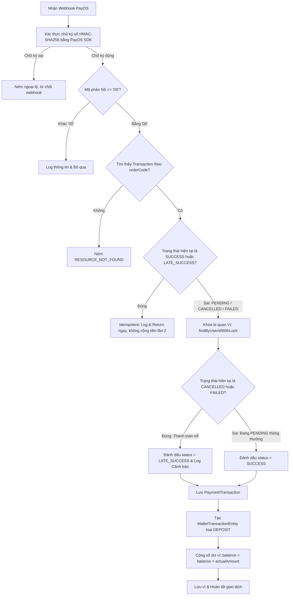

# 📋 KẾ HOẠCH KIỂM THỬ: PAYMENT, WALLET LEDGER & SHOPPING CART MODULE
Dự án: **CodeLearning Platform**  
Module: **Thanh toán PayOS, Sổ cái ví điện tử (Ledger), Giỏ hàng & Xử lý đơn hàng**  
Vị trí tài liệu: `backend/docs/plan_test/05_PLAN_PAYMENT_AND_WALLET_MODULE.md`  
Độ bao phủ mục tiêu: **Line Coverage $\ge 95\%$, Branch Coverage $\ge 90\%$**

---

## 1. Danh sách các Class trong phạm vi kiểm thử

| Thành phần | Đường dẫn file | Vai trò chính |
| :--- | :--- | :--- |
| **Service** | `service/payment/PaymentService.java` | Tạo link thanh toán PayOS (HMAC-SHA256), xử lý Webhook, phát hiện thanh toán trễ (`LATE_SUCCESS`) |
| **Service** | `service/payment/WalletService.java` | Lắng nghe `UserRegisteredEvent` tạo ví mới ban đầu |
| **Service** | `service/payment/OrderService.java` | Thanh toán mua khóa học từ ví (Pessimistic Lock, trừ tiền, tạo Enrollment) |
| **Service** | `service/payment/CartService.java` | Thêm, xóa, làm trống giỏ hàng (kiểm tra trùng lặp khóa học, khóa đã mua) |
| **Service** | `service/admin/impl/AdminPaymentServiceImpl.java` | Báo cáo, lọc danh sách giao dịch nạp tiền cho Admin |
| **Scheduler** | `scheduler/PaymentCronJob.java` | Quét đơn hàng treo `PENDING`, tự động hủy sau 30 phút hoặc bù tiền nếu PayOS đã thu |
| **Controller** | `controller/payment/PaymentController.java` | Endpoint nạp tiền và Webhook PayOS |
| **Controller** | `controller/payment/OrderController.java` | Endpoint thanh toán đơn hàng |
| **Controller** | `controller/payment/CartController.java` | Endpoint giỏ hàng |

---

## 2. Phân tích chi tiết Dòng lệnh & Rẽ nhánh (Line & Branch Coverage Analysis)

### 2.1. `PaymentService.java`

#### Phương thức 1: `createDepositPayment(Long userId, PaymentDepositRequest request)`
* **Nhánh 1 (User & Wallet Verification):**
  * Nhánh 1.1: Không tìm thấy User -> Ném `AppException(ErrorCode.USER_NOT_FOUND)`.
  * Nhánh 1.2: User bị khóa/vô hiệu hóa -> Ném ngoại lệ qua `user.validateStatus()`.
  * Nhánh 1.3: Không tìm thấy Ví người dùng -> Ném `AppException(ErrorCode.RESOURCE_NOT_FOUND)`.
* **Nhánh 2 (Tạo giao dịch PENDING & Ký số):**
  * Sinh mã `orderCode`, lưu bản ghi `PaymentTransactionEntity` với trạng thái `PENDING`.
  * Tính chuỗi dữ liệu ký HMAC: `amount=...&cancelUrl=...&description=...&orderCode=...&returnUrl=...`.
  * Ký số thành công qua thuật toán HmacSHA256.
* **Nhánh 3 (Giao tiếp mạng PayOS qua WebClient):**
  * Nhánh 3.1: PayOS trả về `responseNode == null` -> Ném `AppException(ErrorCode.UNCATEGORIZED_EXCEPTION)`.
  * Nhánh 3.2: PayOS trả về mã lỗi (`code != "00"`) -> Ném RuntimeException kèm mô tả lỗi từ PayOS.
  * Nhánh 3.3: Dữ liệu PayOS trả về thiếu trường `checkoutUrl` -> Ném `AppException(ErrorCode.UNCATEGORIZED_EXCEPTION)`.
  * Nhánh 3.4 (Happy Path): Lấy được `checkoutUrl`, trả về `PaymentDepositResponse` chứa URL và mã giao dịch.
  * Nhánh 3.5: Gặp lỗi kết nối/timeout -> Bắt ngoại lệ, log lỗi và ném `AppException(ErrorCode.UNCATEGORIZED_EXCEPTION)`.

---

#### Phương thức 2: `handlePayOSWebhook(ObjectNode payload)`
Quy trình Webhook yêu cầu độ an toàn tuyệt đối, chống gian lận và chống xử lý trùng lặp (Idempotency):



* **Nhánh 1 (Xác thực chữ ký):**
  * `payOS.verifyPaymentWebhookData` ném Exception nếu checksum key không khớp hoặc payload bị sửa đổi.
* **Nhánh 2 (Mã phản hồi PayOS):**
  * `data.getCode() != "00"` -> Log bỏ qua, không xử lý cộng tiền.
* **Nhánh 3 (Tìm kiếm giao dịch):**
  * Không tìm thấy giao dịch theo `transactionCode` -> Ném `AppException(ErrorCode.RESOURCE_NOT_FOUND)`.
* **Nhánh 4 (Kiểm tra Idempotency):**
  * `paymentTx.getStatus() == SUCCESS || LATE_SUCCESS` -> Bỏ qua ngay lập tức, đảm bảo không bao giờ bị cộng tiền 2 lần cho 1 đơn hàng.
* **Nhánh 5 (Pessimistic Locking & Late Payment Detection):**
  * Khóa ví bằng `walletRepository.findByUserIdWithLock(userId)`.
  * Nhánh 5.1: Giao dịch trước đó đã bị CronJob đánh dấu `CANCELLED` hoặc `FAILED` nhưng tiền vẫn về sau đó -> Chuyển thành `LATE_SUCCESS`, ghi log cảnh báo đặc biệt.
  * Nhánh 5.2: Giao dịch đang `PENDING` -> Chuyển thành `SUCCESS`.
* **Nhánh 6 (Cộng tiền & Ghi sổ cái):**
  * Cập nhật `PaymentTransactionEntity`.
  * Tạo bản ghi sổ cái `WalletTransactionEntity` (loại `DEPOSIT`).
  * Tăng số dư ví: `wallet.setBalance(wallet.getBalance().add(actualAmount))`.

---

### 2.2. `OrderService.java`

#### Phương thức: `createCheckout(Long userId, OrderCheckoutRequest request)`
* **Nhánh 1:** `request.getCourseIds() == null || isEmpty()` -> `AppException(ErrorCode.INVALID_REQUEST)`.
* **Nhánh 2:** Không tìm thấy user -> `AppException(ErrorCode.USER_NOT_FOUND)`.
* **Nhánh 3:** User bị `LOCKED` hoặc `DISABLED` -> Ngoại lệ từ `user.validateStatus()`.
* **Nhánh 4:** Số lượng khóa học tìm thấy không đủ so với yêu cầu -> `AppException(ErrorCode.COURSE_NOT_FOUND)`.
* **Nhánh 5:** Có ít nhất một khóa học chưa `ACTIVE` -> `AppException(ErrorCode.COURSE_INACTIVE)`.
* **Nhánh 6:** Người dùng đã sở hữu ít nhất 1 khóa học trong danh sách -> `AppException(ErrorCode.ALREADY_ENROLLED)`.
* **Nhánh 7:** Không tìm thấy ví với khóa bi quan -> `AppException(ErrorCode.RESOURCE_NOT_FOUND)`.
* **Nhánh 8:** `wallet.getBalance().compareTo(totalAmount) < 0` -> `AppException(ErrorCode.INSUFFICIENT_BALANCE)`.
* **Nhánh 9 (Happy Path):**
  * Trừ tiền ví: `wallet.setBalance(balance.subtract(totalAmount))`.
  * Lưu ví.
  * Tạo đơn hàng `OrderEntity` (status `COMPLETED`).
  * Tạo các `OrderItemEntity`.
  * Ghi sổ cái `WalletTransactionEntity` (loại `PURCHASE`, số tiền âm/trừ).
  * Tạo bản ghi `EnrollmentEntity` kích hoạt khóa học cho user.
  * Trả về `OrderCheckoutResponse`.

---

### 2.3. `PaymentCronJob.java`

#### Phương thức: `scanPendingTransactions()`
* **Nhánh 1:** Không có giao dịch `PENDING` nào trong DB -> Return ngay.
* **Nhánh 2 (Duyệt từng giao dịch PENDING):**
  * Gọi API tra cứu trạng thái đơn hàng PayOS:
    * Nhánh 2.1: PayOS trả về `PAID` hoặc `SUCCESS` (Webhook bị lỡ) -> Gọi `paymentService.processSuccessfulPaymentFallback(code, amount)`.
    * Nhánh 2.2: PayOS trả về `CANCELLED` hoặc `EXPIRED` -> Cập nhật status thành `CANCELLED`, lưu DB.
    * Nhánh 2.3: PayOS vẫn trả về `PENDING`:
      * Nếu giao dịch tạo cách đây $> 30$ phút -> Cưỡng chế hủy (`status = CANCELLED`).
      * Nếu $< 30$ phút -> Giữ nguyên, chờ tiếp.
* **Nhánh 3 (Exception Handling):**
  * Gọi PayOS gặp Exception: Nếu đơn hàng đã quá 30 phút -> Cưỡng chế hủy để giải phóng tài nguyên.

---

## 3. Ma trận Kịch bản Kiểm thử (Test Cases Matrix)

| Test ID | Class / Method | Điều kiện đầu vào (Given) | Hành vi kỳ vọng (Then) |
| :--- | :--- | :--- | :--- |
| **PAY_01** | `createDepositPayment` | User status = LOCKED | Throws `AppException(ACCOUNT_LOCKED)` |
| **PAY_02** | `createDepositPayment` | PayOS trả về code = "01" (Lỗi thẻ) | Throws RuntimeException chứa mô tả lỗi |
| **PAY_03** | `createDepositPayment` | Thành công | Lưu PENDING tx, trả về checkoutUrl |
| **WH_01** | `handlePayOSWebhook` | Chữ ký không hợp lệ | PayOS SDK ném exception, không xử lý DB |
| **WH_02** | `handlePayOSWebhook` | Mã code webhook khác "00" | Bỏ qua, không thay đổi số dư ví |
| **WH_03** | `handlePayOSWebhook` | Giao dịch đã là `SUCCESS` (Gọi lại lần 2) | Bỏ qua ngay lập tức (Idempotent), không cộng tiền |
| **WH_04** | `handlePayOSWebhook` | Giao dịch trước đó bị hủy `CANCELLED` | Đổi thành `LATE_SUCCESS`, cộng tiền ví, log warning |
| **WH_05** | `handlePayOSWebhook` | Giao dịch `PENDING` hợp lệ | Chuyển `SUCCESS`, tạo Ledger DEPOSIT, tăng balance |
| **ORD_01** | `createCheckout` | courseIds rỗng | Throws `AppException(INVALID_REQUEST)` |
| **ORD_02** | `createCheckout` | Khóa học có status DRAFT | Throws `AppException(COURSE_INACTIVE)` |
| **ORD_03** | `createCheckout` | Đã mua khóa học này rồi | Throws `AppException(ALREADY_ENROLLED)` |
| **ORD_04** | `createCheckout` | Ví có 100k, giỏ hàng 200k | Throws `AppException(INSUFFICIENT_BALANCE)` |
| **ORD_05** | `createCheckout` | Ví có 500k, giỏ hàng 200k | Ví còn 300k, tạo Order COMPLETED, tạo Enrollment |
| **CRON_01** | `scanPendingTransactions` | PayOS báo đơn hàng đã PAID | Gọi hàm bù tiền `processSuccessfulPaymentFallback` |
| **CRON_02** | `scanPendingTransactions` | Đơn hàng PENDING quá 30 phút | Cưỡng chế chuyển trạng thái sang `CANCELLED` |

---

## 4. Test Blueprint Mẫu: `PaymentServiceTest.java`

```java
package com.thanhmila.codelearning.service.payment;

import com.fasterxml.jackson.databind.ObjectMapper;
import com.fasterxml.jackson.databind.node.ObjectNode;
import com.thanhmila.codelearning.configuration.ProjectProperties;
import com.thanhmila.codelearning.entity.enums.TransactionStatus;
import com.thanhmila.codelearning.entity.enums.WalletTransactionType;
import com.thanhmila.codelearning.entity.payment.PaymentTransactionEntity;
import com.thanhmila.codelearning.entity.payment.WalletEntity;
import com.thanhmila.codelearning.entity.user.UserEntity;
import com.thanhmila.codelearning.repository.payment.PaymentTransactionRepository;
import com.thanhmila.codelearning.repository.payment.WalletRepository;
import com.thanhmila.codelearning.repository.payment.WalletTransactionRepository;
import org.junit.jupiter.api.DisplayName;
import org.junit.jupiter.api.Nested;
import org.junit.jupiter.api.Test;
import org.junit.jupiter.api.extension.ExtendWith;
import org.mockito.InjectMocks;
import org.mockito.Mock;
import org.mockito.junit.jupiter.MockitoExtension;
import vn.payos.PayOS;
import vn.payos.type.WebhookData;

import java.math.BigDecimal;
import java.util.Optional;

import static org.assertj.core.api.Assertions.assertThat;
import static org.mockito.ArgumentMatchers.any;
import static org.mockito.Mockito.*;

@ExtendWith(MockitoExtension.class)
@DisplayName("PaymentService Webhook & Idempotency Tests")
class PaymentServiceTest {

    @Mock PayOS payOS;
    @Mock ProjectProperties.Payos payosProps;
    @Mock WalletRepository walletRepository;
    @Mock PaymentTransactionRepository paymentTransactionRepository;
    @Mock WalletTransactionRepository walletTransactionRepository;

    @InjectMocks PaymentService paymentService;

    private final ObjectMapper objectMapper = new ObjectMapper();

    @Nested
    @DisplayName("handlePayOSWebhook Branch Tests")
    class WebhookTests {

        @Test
        @DisplayName("Idempotency: Should ignore duplicate webhook when transaction is already SUCCESS")
        void shouldIgnoreDuplicateWebhook_WhenAlreadySuccess() throws Exception {
            ObjectNode payload = objectMapper.createObjectNode();
            WebhookData data = new WebhookData(123456L, 100000, "description", "accountNumber", "reference", "transactionDateTime", "currency", "paymentLinkId", "00", "desc");

            when(payOS.verifyPaymentWebhookData(any())).thenReturn(data);

            PaymentTransactionEntity existingTx = PaymentTransactionEntity.builder()
                    .transactionCode("123456")
                    .status(TransactionStatus.SUCCESS)
                    .build();

            when(paymentTransactionRepository.findByTransactionCode("123456")).thenReturn(Optional.of(existingTx));

            // Execute
            paymentService.handlePayOSWebhook(payload);

            // Assert: Không được gọi khóa ví và không cộng tiền lần 2
            verify(walletRepository, never()).findByUserIdWithLock(any());
            verify(walletTransactionRepository, never()).save(any());
            verify(paymentTransactionRepository, never()).save(any());
        }

        @Test
        @DisplayName("Late Payment: Should mark as LATE_SUCCESS when webhook arrives for CANCELLED transaction")
        void shouldHandleLateSuccess_WhenArrivesForCancelledTransaction() throws Exception {
            ObjectNode payload = objectMapper.createObjectNode();
            WebhookData data = new WebhookData(999999L, 200000, "Thanh toan nap xu", "acc", "ref", "time", "VND", "linkId", "00", "desc");

            when(payOS.verifyPaymentWebhookData(any())).thenReturn(data);

            UserEntity user = UserEntity.builder().id(10L).build();
            WalletEntity wallet = WalletEntity.builder().id(1L).user(user).balance(BigDecimal.valueOf(50000)).build();

            PaymentTransactionEntity cancelledTx = PaymentTransactionEntity.builder()
                    .transactionCode("999999")
                    .wallet(wallet)
                    .status(TransactionStatus.CANCELLED)
                    .build();

            when(paymentTransactionRepository.findByTransactionCode("999999")).thenReturn(Optional.of(cancelledTx));
            when(walletRepository.findByUserIdWithLock(10L)).thenReturn(Optional.of(wallet));

            // Execute
            paymentService.handlePayOSWebhook(payload);

            // Assert
            assertThat(cancelledTx.getStatus()).isEqualTo(TransactionStatus.LATE_SUCCESS);
            assertThat(wallet.getBalance()).isEqualByComparingTo(BigDecimal.valueOf(250000)); // 50k + 200k = 250k

            verify(paymentTransactionRepository).save(cancelledTx);
            verify(walletRepository).save(wallet);
            verify(walletTransactionRepository).save(argThat(tx -> 
                    tx.getType() == WalletTransactionType.DEPOSIT && 
                    tx.getAmount().compareTo(BigDecimal.valueOf(200000)) == 0
            ));
        }
    }
}
```
