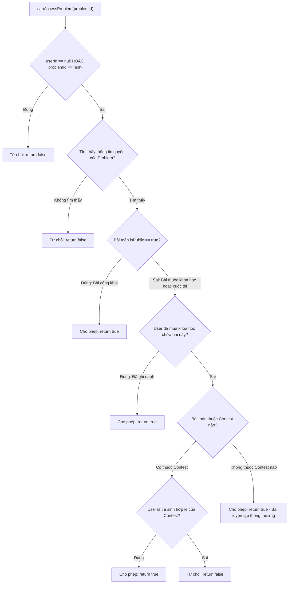

# 📋 KẾ HOẠCH KIỂM THỬ: SECURITY, FILTERS, EXCEPTION & NOTIFICATION MODULE
Dự án: **CodeLearning Platform**  
Module: **Quyền hạn động (SpEL), JWT Decoder, Rate Limiter, Exception Handlers & SendGrid Webhook**  
Vị trí tài liệu: `backend/docs/plan_test/06_PLAN_SECURITY_EXCEPTION_AND_INFRA_MODULE.md`  
Độ bao phủ mục tiêu: **Line Coverage $\ge 95\%$, Branch Coverage $\ge 90\%$**

---

## 1. Danh sách các Class trong phạm vi kiểm thử

| Thành phần | Đường dẫn file | Vai trò chính |
| :--- | :--- | :--- |
| **Security Bean** | `security/CourseSecurity.java` | Đánh giá SpEL `@courseSecurity.canAccessProblem(...)`, `@canAccessLesson(...)` |
| **Security** | `security/CustomJwtDecoder.java` | Giải mã JWT và kiểm tra token trong Blacklist trước khi cho phép truy cập |
| **Filter / Interceptor** | `security/IpRateLimitFilter.java` & `UserRateLimitInterceptor.java` | Giới hạn tần suất request (Bucket4j) theo IP & User ID |
| **Interceptor** | `configuration/WebSocketAuthInterceptor.java` | Chặn handshake STOMP WebSocket để kiểm tra tính hợp lệ của token |
| **Exception** | `exception/GlobalExceptionHandler.java` | Xử lý tập trung `AppException`, lỗi Validate DTO, Type Mismatch, Malformed JSON |
| **Service** | `service/email/impl/SendGridWebhookServiceImpl.java` | Xử lý Webhook báo cáo email nảy (bounce), spam, tự động hủy gửi email user |
| **Service** | `service/cloudinary/CloudinaryService.java` | Upload và xóa tài nguyên media trên Cloudinary |

---

## 2. Phân tích chi tiết Dòng lệnh & Rẽ nhánh (Line & Branch Coverage Analysis)

### 2.1. `CourseSecurity.java` (Quyền truy cập tài nguyên SpEL)

Bean này quyết định người dùng có được vào giải bài toán OJ, xem bài học hay làm quiz hay không:



* **Phương thức `canAccessProblem(Long problemId)`:**
  * **Nhánh 1:** `userId == null` hoặc `problemId == null` -> `false`.
  * **Nhánh 2:** Không tìm thấy chi tiết bài toán -> `false`.
  * **Nhánh 3:** `isPublic == true` -> `true`.
  * **Nhánh 4:** Người dùng đã mua khóa học chứa bài toán (`isUserEnrolledByProblemId == true`) -> `true`.
  * **Nhánh 5:** Bài thuộc cuộc thi:
    * Nhánh 5a: Người dùng là thí sinh của ít nhất 1 cuộc thi chứa bài toán -> `true`.
    * Nhánh 5b: Người dùng không tham gia cuộc thi nào trong số đó -> `false`.
  * **Nhánh 6:** Không công khai nhưng cũng không thuộc bài học/cuộc thi nào -> `true`.

* **Phương thức `canAccessLesson(Long lessonId)`:**
  * **Nhánh 1:** `userId == null` hoặc `lessonId == null` -> `false`.
  * **Nhánh 2:** `enrollmentRepository.isUserEnrolledInLesson(userId, lessonId) == true` -> `true`.
  * **Nhánh 3:** Chưa mua -> `false`.

* **Phương thức `canAccessContest(Long problemId)`:**
  * **Nhánh 1:** `userId == null` hoặc `problemId == null` -> `false`.
  * **Nhánh 2:** `contestIds` rỗng (bài không thuộc contest) -> `false`.
  * **Nhánh 3:** User là thí sinh của contest -> `true`; Không phải thí sinh -> `false`.

---

### 2.2. `GlobalExceptionHandler.java`

* **Nhánh 1: `@ExceptionHandler(AppException.class)`:**
  * Bắt ngoại lệ nghiệp vụ.
  * Trích xuất `errorCode.getHttpStatus()`, `errorCode.getCode()`, `errorCode.getMessage()`.
  * Kiểm tra cấu trúc JSON trả về: `status`, `code`, `message`, `result = null`, `timestamp`.
* **Nhánh 2: `@ExceptionHandler(MethodArgumentNotValidException.class)`:**
  * Lấy `getDefaultMessage()` của trường lỗi đầu tiên trong `BindingResult`.
  * Map chuỗi String đó thành Enum `ErrorCode.valueOf(enumKey)`.
  * Trả về HTTP Status tương ứng của ErrorCode đó.
* **Nhánh 3: `@ExceptionHandler(MethodArgumentTypeMismatchException.class)`:**
  * Lấy tên tham số, giá trị truyền sai, kiểu dữ liệu mong đợi.
  * Trả về HTTP 400 và mã lỗi `4000` kèm thông điệp format: `Type mismatch for parameter 'X': value 'Y' cannot be converted to 'Z'`.
* **Nhánh 4: `@ExceptionHandler(HttpMessageNotReadableException.class)`:**
  * Bắt lỗi JSON sai cú pháp (malformed JSON, thiếu ngoặc nhọn).
  * Trả về HTTP 400 và mã lỗi `INVALID_REQUEST_BODY` (code 1006).

---

### 2.3. `SendGridWebhookServiceImpl.java`

* **Phương thức: `processWebhookEvents(List<SendGridWebhookEvent> events)`:**
  * Duyệt từng sự kiện:
    * Lưu bản ghi `EmailDeliveryLogEntity` (email, eventType, reason, sgEventId, timestamp).
    * Nhánh 1: Sự kiện là `bounce`, `spamreport`, `dropped`, hoặc `unsubscribe`:
      * Tìm user theo email. Nếu tìm thấy: Gán `user.setIsEmailValid(false)` và lưu DB để không gửi email làm giảm danh tiếng domain.
    * Nhánh 2: Sự kiện bình thường (`delivered`, `open`, `click`) -> Không sửa đổi trạng thái user.

---

### 2.4. `CustomJwtDecoder.java` & Rate Limiter

* **`CustomJwtDecoder.decode(String token)`:**
  * Nhánh 1: Gọi `authenticationService.verifyToken(token, false)`. Nếu token không hợp lệ -> Ném `BadJwtException`.
  * Nhánh 2: Token hợp lệ -> Giải mã và trả về đối tượng `Jwt`.
* **`IpRateLimitFilter.doFilterInternal()`:**
  * Nhánh 1: Token bucket còn token khả dụng -> Cho qua (`filterChain.doFilter`).
  * Nhánh 2: Vượt quá giới hạn (Rate limit exceeded) -> Trả về HTTP 429 kèm JSON lỗi `TOO_MANY_REQUESTS`.

---

## 3. Ma trận Kịch bản Kiểm thử (Test Cases Matrix)

| Test ID | Class / Method | Điều kiện đầu vào (Given) | Hành vi kỳ vọng (Then) |
| :--- | :--- | :--- | :--- |
| **SEC_01** | `canAccessProblem` | `userId = null` | Trả về `false` |
| **SEC_02** | `canAccessProblem` | Problem là `isPublic = true` | Trả về `true` (không cần kiểm tra khóa học) |
| **SEC_03** | `canAccessProblem` | Problem private, user đã ghi danh khóa học | Trả về `true` |
| **SEC_04** | `canAccessProblem` | Problem trong Contest, user là thí sinh | Trả về `true` |
| **SEC_05** | `canAccessProblem` | Problem trong Contest, user KHÔNG tham gia | Trả về `false` |
| **EX_01** | `GlobalExceptionHandler` | Ném `AppException(COURSE_NOT_FOUND)` | Trả về HTTP 404, Code = 3000, Message chuẩn |
| **EX_02** | `GlobalExceptionHandler` | Ném `MethodArgumentNotValidException` (msg="PASSWORD_INVALID") | Trả về HTTP 400, Code = 2007 |
| **EX_03** | `GlobalExceptionHandler` | Ném `MethodArgumentTypeMismatchException` (id="abc") | Trả về HTTP 400, Code = 4000, Message chứa 'abc' |
| **EX_04** | `GlobalExceptionHandler` | Ném `HttpMessageNotReadableException` | Trả về HTTP 400, Code = 1006 (INVALID_REQUEST_BODY) |
| **SG_01** | `processWebhookEvents` | Sự kiện `bounce` cho user A | Lưu log, cập nhật `user.isEmailValid = false` |
| **SG_02** | `processWebhookEvents` | Sự kiện `delivered` cho user A | Lưu log, giữ nguyên `user.isEmailValid = true` |

---

## 4. Test Blueprint Mẫu: `CourseSecurityTest.java` & `GlobalExceptionHandlerTest.java`

```java
package com.thanhmila.codelearning.security;

import com.thanhmila.codelearning.repository.contest.ContestParticipantRepository;
import com.thanhmila.codelearning.repository.course.EnrollmentRepository;
import com.thanhmila.codelearning.repository.oj.OnlineJudgeProblemRepository;
import com.thanhmila.codelearning.repository.projection.ProblemAccessProjection;
import org.junit.jupiter.api.AfterEach;
import org.junit.jupiter.api.BeforeEach;
import org.junit.jupiter.api.DisplayName;
import org.junit.jupiter.api.Test;
import org.junit.jupiter.api.extension.ExtendWith;
import org.mockito.InjectMocks;
import org.mockito.Mock;
import org.mockito.junit.jupiter.MockitoExtension;
import org.springframework.security.core.Authentication;
import org.springframework.security.core.context.SecurityContext;
import org.springframework.security.core.context.SecurityContextHolder;
import org.springframework.security.oauth2.jwt.Jwt;

import java.util.Collections;
import java.util.List;
import java.util.Optional;

import static org.assertj.core.api.Assertions.assertThat;
import static org.mockito.Mockito.*;

@ExtendWith(MockitoExtension.class)
@DisplayName("CourseSecurity SpEL Evaluator Unit Tests")
class CourseSecurityTest {

    @Mock EnrollmentRepository enrollmentRepository;
    @Mock ContestParticipantRepository contestParticipantRepository;
    @Mock OnlineJudgeProblemRepository onlineJudgeProblemRepository;

    @InjectMocks CourseSecurity courseSecurity;

    private Long userId = 10L;
    private Long problemId = 100L;

    @BeforeEach
    void setupSecurityContext() {
        Jwt jwt = mock(Jwt.class);
        when(jwt.getClaim("userId")).thenReturn(userId);

        Authentication auth = mock(Authentication.class);
        when(auth.getPrincipal()).thenReturn(jwt);

        SecurityContext securityContext = mock(SecurityContext.class);
        when(securityContext.getAuthentication()).thenReturn(auth);
        SecurityContextHolder.setContext(securityContext);
    }

    @AfterEach
    void clearSecurityContext() {
        SecurityContextHolder.clearContext();
    }

    @Test
    @DisplayName("canAccessProblem: Should grant access when problem is public")
    void shouldGrantAccess_WhenProblemIsPublic() {
        ProblemAccessProjection projection = mock(ProblemAccessProjection.class);
        when(projection.getIsPublic()).thenReturn(true);

        when(onlineJudgeProblemRepository.findAccessDetailsByProblemId(problemId)).thenReturn(Optional.of(projection));

        boolean canAccess = courseSecurity.canAccessProblem(problemId);

        assertThat(canAccess).isTrue();
        verify(enrollmentRepository, never()).isUserEnrolledByProblemId(any(), any());
    }

    @Test
    @DisplayName("canAccessProblem: Should grant access when user is enrolled in course containing the problem")
    void shouldGrantAccess_WhenUserEnrolledInCourse() {
        ProblemAccessProjection projection = mock(ProblemAccessProjection.class);
        when(projection.getIsPublic()).thenReturn(false);

        when(onlineJudgeProblemRepository.findAccessDetailsByProblemId(problemId)).thenReturn(Optional.of(projection));
        when(enrollmentRepository.isUserEnrolledByProblemId(userId, problemId)).thenReturn(true);

        boolean canAccess = courseSecurity.canAccessProblem(problemId);

        assertThat(canAccess).isTrue();
    }

    @Test
    @DisplayName("canAccessProblem: Should deny access when problem belongs to contest and user is not registered")
    void shouldDenyAccess_WhenUserNotInContest() {
        ProblemAccessProjection projection = mock(ProblemAccessProjection.class);
        when(projection.getIsPublic()).thenReturn(false);

        when(onlineJudgeProblemRepository.findAccessDetailsByProblemId(problemId)).thenReturn(Optional.of(projection));
        when(enrollmentRepository.isUserEnrolledByProblemId(userId, problemId)).thenReturn(false);
        when(onlineJudgeProblemRepository.findContestIdsByProblemId(problemId)).thenReturn(List.of(99L));
        when(contestParticipantRepository.isUserParticipantOfAnyContest(userId, List.of(99L))).thenReturn(false);

        boolean canAccess = courseSecurity.canAccessProblem(problemId);

        assertThat(canAccess).isFalse();
    }
}
```

```java
package com.thanhmila.codelearning.exception;

import com.thanhmila.codelearning.dto.response.ApiResponse;
import org.junit.jupiter.api.DisplayName;
import org.junit.jupiter.api.Test;
import org.springframework.http.HttpStatus;
import org.springframework.http.ResponseEntity;
import org.springframework.web.method.annotation.MethodArgumentTypeMismatchException;

import static org.assertj.core.api.Assertions.assertThat;
import static org.mockito.Mockito.mock;
import static org.mockito.Mockito.when;

@DisplayName("GlobalExceptionHandler Unit Tests")
class GlobalExceptionHandlerTest {

    private final GlobalExceptionHandler handler = new GlobalExceptionHandler();

    @Test
    @DisplayName("Handle AppException properly with corresponding HttpStatus and Code")
    void shouldHandleAppException() {
        AppException ex = new AppException(ErrorCode.COURSE_NOT_FOUND);

        ResponseEntity<ApiResponse<Object>> response = handler.appException(ex);

        assertThat(response.getStatusCode()).isEqualTo(HttpStatus.NOT_FOUND);
        assertThat(response.getBody()).isNotNull();
        assertThat(response.getBody().getCode()).isEqualTo(ErrorCode.COURSE_NOT_FOUND.getCode());
        assertThat(response.getBody().getMessage()).isEqualTo(ErrorCode.COURSE_NOT_FOUND.getMessage());
    }

    @Test
    @DisplayName("Handle MethodArgumentTypeMismatchException with custom message")
    void shouldHandleTypeMismatchException() {
        MethodArgumentTypeMismatchException ex = mock(MethodArgumentTypeMismatchException.class);
        when(ex.getName()).thenReturn("courseId");
        when(ex.getValue()).thenReturn("invalid_id");
        doReturn(Long.class).when(ex).getRequiredType();

        ResponseEntity<ApiResponse<Object>> response = handler.handleTypeMismatch(ex);

        assertThat(response.getStatusCode()).isEqualTo(HttpStatus.BAD_REQUEST);
        assertThat(response.getBody()).isNotNull();
        assertThat(response.getBody().getCode()).isEqualTo(4000);
        assertThat(response.getBody().getMessage()).contains("courseId", "invalid_id", "Long");
    }
}
```
