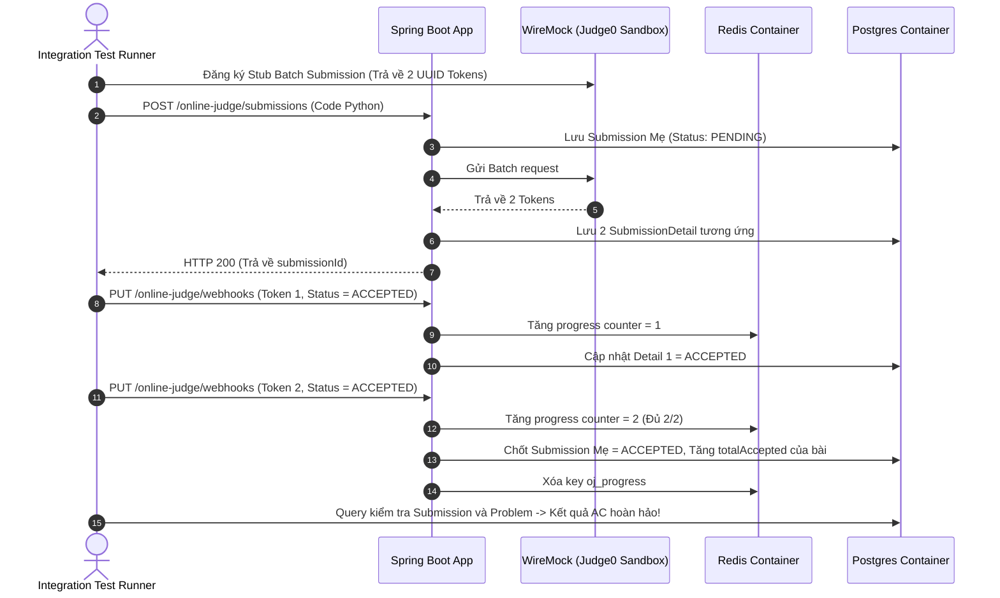

# 📋 KẾ HOẠCH KIỂM THỬ: INTEGRATION TESTS, TESTCONTAINERS & CI/CD PIPELINE
Dự án: **CodeLearning Platform**  
Module: **Kiểm thử tích hợp (End-to-End), Docker Testcontainers, WireMock & Tự động hóa CI/CD**  
Vị trí tài liệu: `backend/docs/plan_test/07_PLAN_INTEGRATION_TESTS_AND_CI_CD.md`  
Độ bao phủ mục tiêu: **Kiểm chứng các luồng liên module (E2E) & Quality Gate tự động**

---

## 1. Mục tiêu Kiểm thử Tích hợp (Integration Test Strategy)

Trong khi Unit Test tập trung xử lý rẽ nhánh logic nội bộ của từng class, **Integration Test** có nhiệm vụ:
1. Xác nhận sự phối hợp chính xác giữa các tầng: `Controller -> Interceptor -> Security -> Service -> Repository -> PostgreSQL`.
2. Kiểm tra tính toàn vẹn của các giao dịch DB (`@Transactional`, Rollback khi có lỗi).
3. Kiểm tra tính đúng đắn của các câu truy vấn phức tạp (Native SQL, Dynamic Specification, EntityGraph).
4. Kiểm tra sự tương tác thực tế với **Redis** (Atomic increment, expiration), **RabbitMQ** (Delayed Exchange message delivery) và **WireMock** (Giả lập Judge0, PayOS).

---

## 2. Thiết lập Môi trường Test với Testcontainers & WireMock

### 2.1. Cấu hình Abstract Base Test Class (`BaseIntegrationTest.java`)
Tất cả các bài test tích hợp sẽ kế thừa từ class cơ sở này để tái sử dụng container Docker duy nhất (Singleton Container Pattern), giúp tối ưu thời gian chạy:

```java
package com.thanhmila.codelearning;

import com.github.tomakehurst.wiremock.WireMockServer;
import com.github.tomakehurst.wiremock.core.WireMockConfiguration;
import org.junit.jupiter.api.AfterAll;
import org.junit.jupiter.api.BeforeAll;
import org.springframework.boot.test.autoconfigure.web.servlet.AutoConfigureMockMvc;
import org.springframework.boot.test.context.SpringBootTest;
import org.springframework.test.context.DynamicPropertyRegistry;
import org.springframework.test.context.DynamicPropertySource;
import org.testcontainers.containers.GenericContainer;
import org.testcontainers.containers.PostgreSQLContainer;
import org.testcontainers.containers.RabbitMQContainer;
import org.testcontainers.junit.jupiter.Testcontainers;

@SpringBootTest(webEnvironment = SpringBootTest.WebEnvironment.RANDOM_PORT)
@AutoConfigureMockMvc
@Testcontainers
public abstract class BaseIntegrationTest {

    // 1. Khởi tạo PostgreSQL 15 Container
    static final PostgreSQLContainer<?> postgres = new PostgreSQLContainer<>("postgres:15-alpine")
            .withDatabaseName("codelearning_test")
            .withUsername("postgres")
            .withPassword("password");

    // 2. Khởi tạo Redis Container
    static final GenericContainer<?> redis = new GenericContainer<>("redis:7-alpine")
            .withExposedPorts(6379);

    // 3. Khởi tạo RabbitMQ Container
    static final RabbitMQContainer rabbitmq = new RabbitMQContainer("rabbitmq:3-management-alpine");

    // 4. WireMock Server giả lập Judge0 & PayOS
    protected static WireMockServer wireMockServer = new WireMockServer(WireMockConfiguration.options().dynamicPort());

    @BeforeAll
    static void startContainers() {
        postgres.start();
        redis.start();
        rabbitmq.start();
        wireMockServer.start();
    }

    @AfterAll
    static void stopContainers() {
        postgres.stop();
        redis.stop();
        rabbitmq.stop();
        wireMockServer.stop();
    }

    // Nạp dynamic properties từ Docker Containers vào Spring Environment
    @DynamicPropertySource
    static void configureProperties(DynamicPropertyRegistry registry) {
        registry.add("spring.datasource.url", postgres::getJdbcUrl);
        registry.add("spring.datasource.username", postgres::getUsername);
        registry.add("spring.datasource.password", postgres::getPassword);

        registry.add("spring.data.redis.host", redis::getHost);
        registry.add("spring.data.redis.port", () -> redis.getMappedPort(6379));

        registry.add("spring.rabbitmq.host", rabbitmq::getHost);
        registry.add("spring.rabbitmq.port", rabbitmq::getAmqpPort);

        registry.add("judge0.base-url", () -> wireMockServer.baseUrl());
        registry.add("jwt.signer-key", () -> "12345678901234567890123456789012");
    }
}
```

---

## 3. Các Kịch bản Kiểm thử End-to-End Trọng yếu

### 3.1. Kịch bản E2E 1: Luồng nộp bài Online Judge & Webhook callback


### 3.2. Kịch bản E2E 2: Luồng Nạp tiền PayOS & Mua khóa học (Pessimistic Lock Ledger)
1. **Bước 1 (Nạp tiền):**
   * Mock endpoint PayOS tạo link thanh toán.
   * Gọi `POST /payments/deposit` với số tiền `200,000 VND`.
   * Kiểm tra bản ghi `payment_transactions` được tạo với trạng thái `PENDING`.
2. **Bước 2 (PayOS gửi Webhook):**
   * Giả lập gửi request `POST /payments/payos-webhook` kèm payload chữ ký hợp lệ.
   * Backend kích hoạt khóa bi quan `findByUserIdWithLock`, cập nhật số dư ví người dùng thành `200,000 VND` và tạo `wallet_transactions` loại `DEPOSIT`.
3. **Bước 3 (Thanh toán giỏ hàng):**
   * Gọi `POST /orders/checkout` mua khóa học có giá `200,000 VND`.
   * Xác nhận số dư ví bị trừ về `0 VND`.
   * Xác nhận bảng `enrollments` có bản ghi mới với trạng thái `ACTIVE`.

---

## 4. Tự động hóa CI/CD với GitHub Actions

Thiết lập file `.github/workflows/backend-test.yml` để chạy toàn bộ Unit Tests, Integration Tests và kiểm tra ngưỡng JaCoCo mỗi khi có Pull Request:

```yaml
name: Backend Test & Quality Gate

on:
  push:
    branches: [ main, develop ]
  pull_request:
    branches: [ main ]

jobs:
  test:
    name: Run Unit & Integration Tests
    runs-on: ubuntu-latest

    services:
      # Sử dụng docker engine có sẵn trên ubuntu-latest cho Testcontainers

    steps:
      - name: Checkout Code
        uses: actions/checkout@v4

      - name: Set up JDK 21
        uses: actions/setup-java@v4
        with:
          java-version: '21'
          distribution: 'temurin'
          cache: maven

      - name: Build & Run Test Suite with JaCoCo
        run: |
          cd backend
          mvn clean verify -Ptest

      - name: Generate JaCoCo Badge & Coverage Report
        id: jacoco
        uses: madrapps/jacoco-report@v1.7.1
        if: always()
        with:
          paths: ${{ github.workspace }}/backend/target/site/jacoco/jacoco.xml
          token: ${{ secrets.GITHUB_TOKEN }}
          min-coverage-overall: 85
          min-coverage-changed-files: 90
          title: "📊 Mã nguồn Backend - Báo cáo Độ bao phủ Kiểm thử"

      - name: Upload JaCoCo HTML Report
        uses: actions/upload-artifact@v4
        if: always()
        with:
          name: jacoco-report
          path: backend/target/site/jacoco/
```

---

## 5. Danh mục các lệnh Maven hữu ích khi làm việc với Test

```bash
# 1. Chạy toàn bộ Unit Tests nhanh (Bỏ qua integration tests)
mvn test -Dtest="*Test"

# 2. Chạy riêng một bài test cụ thể
mvn test -Dtest="OrderServiceTest"

# 3. Chạy toàn bộ Unit Tests và xuất báo cáo JaCoCo HTML
mvn clean test jacoco:report

# 4. Mở báo cáo trên macOS
open target/site/jacoco/index.html

# 5. Kiểm tra Quality Gate (Sẽ báo lỗi BUILD FAILURE nếu coverage < 85%)
mvn jacoco:check
```
