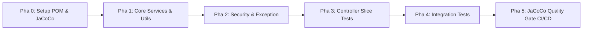

# 📑 HỆ THỐNG KẾ HOẠCH KIỂM THỬ TOÀN DIỆN (COMPREHENSIVE TEST SUITE BLUEPRINT)
Dự án: **CodeLearning Platform Backend**  
Thư mục: `backend/docs/plan_test/`  
Mục tiêu chất lượng: **Line Coverage $\ge 90\%$, Branch Coverage $\ge 85\%$ (100% cho Core Business Logic)**

---

## 🎯 Giới thiệu tổng quan

Hệ thống kế hoạch kiểm thử này được thiết kế riêng biệt cho kiến trúc **Layered Monolith kết hợp Event-Driven & Bất đồng bộ (Async)** của nền tảng CodeLearning. Mỗi tài liệu trong thư mục này phân tích cặn kẽ từng dòng lệnh, từng điều kiện rẽ nhánh (`if-else`, toán tử 3 ngôi, `switch`, `try-catch`, `orElseThrow`), ma trận kịch bản test và code mẫu thực chiến để lập trình viên có thể viết test đạt chuẩn ngay lập tức.

---

## 🗺️ Bản đồ Kế hoạch Kiểm thử (Test Plans Directory)

| STT | Tập tin Kế hoạch | Module phụ trách | Trọng tâm phân tích rẽ nhánh & Line Code |
| :---: | :--- | :--- | :--- |
| **00** | [**00_MASTER_TEST_STRATEGY_AND_STANDARDS.md**](00_MASTER_TEST_STRATEGY_AND_STANDARDS.md) | **Chiến lược & Tiêu chuẩn chung** | Kim tự tháp test, Cấu hình Maven `pom.xml`, Plugin JaCoCo, cấu hình `lombok.config`, quy chuẩn đặt tên AAA. |
| **01** | [**01_PLAN_AUTH_AND_USER_MODULE.md**](01_PLAN_AUTH_AND_USER_MODULE.md) | **Auth & User Management** | Đăng ký, Đăng nhập JWT, Google OAuth2, Token rotation (RTR), Blacklist `invalidated_tokens`, Đổi mật khẩu, Khóa tài khoản. |
| **02** | [**02_PLAN_ONLINE_JUDGE_MODULE.md**](02_PLAN_ONLINE_JUDGE_MODULE.md) | **Online Judge & Sandbox** | Nộp bài, Judge0 batching, Redis atomic counter, Short-circuit contest lock, Webhook callback, Base64 decoding, Sinh testcase tự động. |
| **03** | [**03_PLAN_CONTEST_MODULE.md**](03_PLAN_CONTEST_MODULE.md) | **Contests & ICPC Scoring** | Vòng đời cuộc thi, RabbitMQ delayed message, Consumer kiểm tra Idempotent, Thuật toán ICPC phạt 1200s, WebSocket broadcast. |
| **04** | [**04_PLAN_COURSE_AND_LEARNING_MODULE.md**](04_PLAN_COURSE_AND_LEARNING_MODULE.md) | **Course, Lesson & Quiz** | Đa điều kiện JPA Specification, Phân quyền bài giảng dùng thử (`isTrial`), Chấm thi trắc nghiệm, Đồng bộ cache tiến độ. |
| **05** | [**05_PLAN_PAYMENT_AND_WALLET_MODULE.md**](05_PLAN_PAYMENT_AND_WALLET_MODULE.md) | **Payment, Cart & Wallet Ledger** | Sổ cái ví điện tử, Khóa bi quan Postgres (`SELECT FOR UPDATE`), Ký số HMAC-SHA256 PayOS, Webhook Idempotency, Late payment. |
| **06** | [**06_PLAN_SECURITY_EXCEPTION_AND_INFRA_MODULE.md**](06_PLAN_SECURITY_EXCEPTION_AND_INFRA_MODULE.md) | **Security, Exception & Email** | Quyền SpEL `@courseSecurity`, Custom JWT Decoder, Bucket4j Rate Limiter, `GlobalExceptionHandler`, SendGrid Webhook. |
| **07** | [**07_PLAN_INTEGRATION_TESTS_AND_CI_CD.md**](07_PLAN_INTEGRATION_TESTS_AND_CI_CD.md) | **Integration E2E & CI/CD** | Testcontainers (PostgreSQL 15, RabbitMQ, Redis 7), WireMock giả lập bên ngoài, GitHub Actions CI Pipeline, Quality Gate. |

---

## 🚀 Lộ trình Triển khai Khuyến nghị (Implementation Roadmap)

1. **Pha 0: Chuẩn bị cơ sở hạ tầng**
   * Bổ sung `spring-boot-starter-test`, `spring-security-test`, `jacoco-maven-plugin` vào `pom.xml`.
   * Thêm file `lombok.config` ở thư mục gốc backend (`lombok.addLombokGeneratedAnnotation = true`).
2. **Pha 1: Viết Unit Test cho Tầng Service & Utility (Chiếm 70% khối lượng)**
   * Hoàn thành [ProgressUtilsTest.java](04_PLAN_COURSE_AND_LEARNING_MODULE.md).
   * Hoàn thành [AuthenticationServiceTest.java](01_PLAN_AUTH_AND_USER_MODULE.md).
   * Hoàn thành [OrderServiceTest.java](05_PLAN_PAYMENT_AND_WALLET_MODULE.md) & [PaymentServiceTest.java](05_PLAN_PAYMENT_AND_WALLET_MODULE.md).
   * Hoàn thành [ContestLeaderboardServiceTest.java](03_PLAN_CONTEST_MODULE.md).
   * Hoàn thành [OjSubmissionServiceTest.java](02_PLAN_ONLINE_JUDGE_MODULE.md).
3. **Pha 2: Viết Unit Test cho Security Evaluator & Exception Handler**
   * Hoàn thành [CourseSecurityTest.java](06_PLAN_SECURITY_EXCEPTION_AND_INFRA_MODULE.md).
   * Hoàn thành [GlobalExceptionHandlerTest.java](06_PLAN_SECURITY_EXCEPTION_AND_INFRA_MODULE.md).
4. **Pha 3: Viết Web Slice Tests (`@WebMvcTest`) cho các Controller**
   * Kiểm tra validation đầu vào, status code HTTP, cookie HttpOnly.
5. **Pha 4: Viết Integration Tests với Testcontainers**
   * Kiểm tra luồng E2E nộp bài và thanh toán ví.
6. **Pha 5: Chạy báo cáo JaCoCo & Khóa Quality Gate**
   * Lệnh: `mvn clean test jacoco:report`
   * Mở `target/site/jacoco/index.html` và đảm bảo 100% các nhánh xanh hoàn toàn.

---

## 📊 Bảng Theo dõi Tiến độ (Coverage Checklist)

| STT | Package / Module | Số class cần test | Target Line % | Target Branch % | Trạng thái |
| :---: | :--- | :---: | :---: | :---: | :---: |
| 1 | `service/auth` & `service/user` | 4 | $\ge 95\%$ | $\ge 90\%$ | 📝 Đã lên Plan chi tiết |
| 2 | `service/oj` | 4 | $\ge 95\%$ | $\ge 90\%$ | 📝 Đã lên Plan chi tiết |
| 3 | `service/contest` & `listener` | 4 | $\ge 95\%$ | $\ge 90\%$ | 📝 Đã lên Plan chi tiết |
| 4 | `service/course` & `util` | 6 | $\ge 95\%$ | $\ge 90\%$ | 📝 Đã lên Plan chi tiết |
| 5 | `service/payment` & `scheduler` | 6 | $\ge 95\%$ | $\ge 90\%$ | 📝 Đã lên Plan chi tiết |
| 6 | `security`, `exception`, `email` | 6 | $\ge 95\%$ | $\ge 90\%$ | 📝 Đã lên Plan chi tiết |
| 7 | `controller/**` | 18 | $\ge 85\%$ | $\ge 80\%$ | 📝 Đã lên Plan chi tiết |
| 8 | **Toàn bộ dự án** | **48+ classes** | **$\ge 90\%$** | **$\ge 85\%$** | 🚀 Sẵn sàng thực thi |
