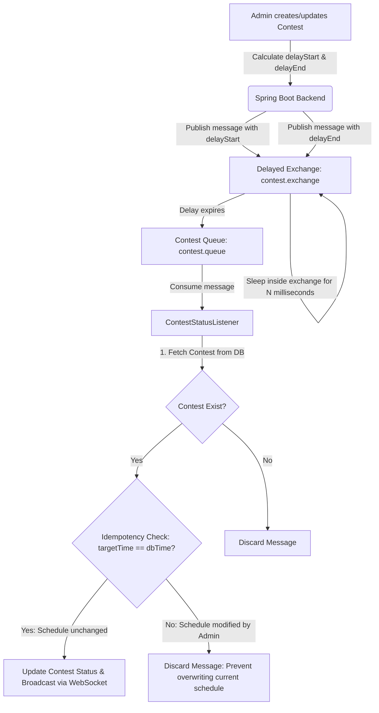
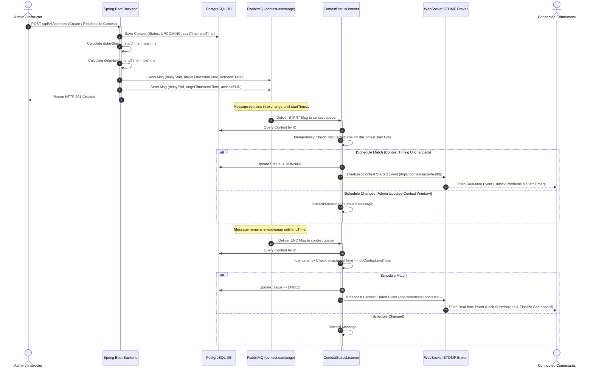

# Event-Driven Contest Status Scheduling Workflow

> CodeLearning Platform - Architecture Specification

This document specifies the automated lifecycle management and event-driven state orchestration for programming contests, using the **RabbitMQ Delayed Message Exchange** plugin instead of recurring database polling.

---

## 1. Technical Motivation and Architectural Design

### Limitations of Polling-Based Scheduling (Cron Jobs)
* **Excessive I/O Overhead**: Periodic polling queries (`SELECT * FROM contests WHERE start_time <= NOW() AND status = 'UPCOMING'`) consume database connections and disk I/O continuously, even during extended periods without scheduled competitions.
* **Schedule Drift**: A cron task executing on a 1-minute interval introduces up to 59 seconds of jitter, causing contests to unlock after their declared start time.
* **Synchronization Latency**: Broadcasting start events to hundreds of waiting contestants requires sub-second execution accuracy.

### Advantages of RabbitMQ Delayed Exchange
* **Millisecond Precision**: Messages are held within the exchange for the exact duration of the delay (`x-delay = targetTime - currentTime`) before being routed to the processing queue.
* **Zero Polling Load**: The database handles zero scheduled polling load between contest events.
* **Instantaneous Event Push**: When delay intervals elapse, the consumer updates contest state and triggers WebSocket STOMP messages to notify contestants immediately.

---

## 2. Architecture Coordination Flow



---

## 3. Sequence Diagram



---

## 4. Rescheduling and Idempotency Control

In real-world contest operations, administrators may reschedule an existing competition (for example, postponing the start from 09:00 to 10:00). Messages scheduled in RabbitMQ exchanges cannot be recalled directly without exchange purge operations.

### Verification Strategy:
1. Message payloads include the targeted timestamp:
   ```java
   public record ContestStatusMessage(
       Long contestId,
       ContestStatus targetStatus,
       Instant targetTime
   ) {}
   ```
2. When the consumer processes a message after delay expiration:
   - Fetches current contest details from PostgreSQL.
   - Compares `message.targetTime()` against `contest.getStartTime()` (for `RUNNING`) or `contest.getEndTime()` (for `ENDED`).
   - **Mismatch**: Indicates that the contest schedule was modified after the message was published. The consumer discards the message without mutating the database.
   - **Match**: The schedule remains valid, and the state transition executes.

---

## 5. Real-Time Client Synchronization via WebSocket

* **Transition to `RUNNING`**:
  - Broadcasts to topic `/topic/contests/{contestId}`.
  - Client applications in the contest lobby automatically:
    1. Reveal problem statements and testcase samples.
    2. Activate the countdown timer.
    3. Enable the Monaco code editor and submission buttons.
* **Transition to `ENDED`**:
  - Emits conclusion events across all active workspaces.
  - Automatically disables code submission buttons in client interfaces.
  - Computes final penalty standings and freezes the contest leaderboard.

---

## 6. Source Code References

* **RabbitMQ Image Definition**: `backend/Dockerfile.rabbitmq`
* **Broker Configuration**: `com.thanhmila.codelearning.configuration.RabbitMQConfig`
* **Contest Service Publisher**: `com.thanhmila.codelearning.service.contest.ContestServiceImpl`
* **Queue Consumer Listener**: `com.thanhmila.codelearning.listener.ContestStatusListener`
* **WebSocket Configuration**: `com.thanhmila.codelearning.configuration.WebSocketConfig`
* **Repository**: `com.thanhmila.codelearning.repository.contest.ContestRepository`
