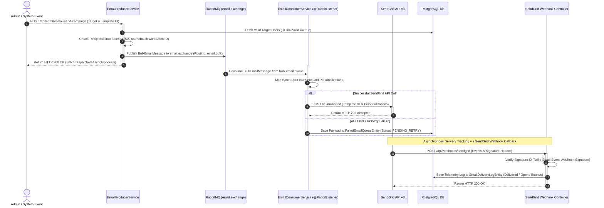

# Asynchronous Bulk Email Pipeline

> CodeLearning Platform - Architecture Specification

This document specifies the architecture and execution flow of the bulk email distribution pipeline, detailing the **RabbitMQ** message topology, **SendGrid API v3** dynamic template integration, persistent **Database Dead Letter Queue (DLQ)** retry mechanisms, and **ECDSA-signed webhook telemetry**.

---

## 1. Operational Challenges and Architectural Solutions

### Challenges in Mass Notification Delivery
* **HTTP Request Timeouts**: Delivering notifications to thousands of users synchronously within a single web request can cause connection timeouts and exhaust application server worker threads.
* **Rate Limits and Transient Failures**: External email delivery providers (e.g., SendGrid) enforce rate limits and can experience transient network partitions. Unhandled failures result in permanent notification loss.
* **Campaign Telemetry**: Administrators require delivery tracking, including delivered, opened, clicked, and bounced message metrics.

### Architectural Solution
1. **Event-Driven Messaging (RabbitMQ)**: Producers enqueue notification requests into RabbitMQ, decoupling user-facing HTTP controllers from external mail delivery operations.
2. **Batch Chunking (500 Recipients per Chunk)**: Recipient lists are partitioned into discrete batches of up to 500 users to stay within SendGrid payload boundaries and maximize throughput.
3. **Database Dead Letter Queue (DLQ)**: Deliveries rejected by SendGrid or interrupted by network errors are written to the `failed_email_queues` table for automated retries.
4. **Signed Webhook Ingestion**: Ingests event callbacks from SendGrid, validating the `X-Twilio-Email-Event-Webhook-Signature` header to record authentic delivery telemetry.

---

## 2. Sequence Diagram



---

## 3. Technical Components in Detail

### 3.1. Producer and Batch Chunking
When a notification campaign is initiated:
1. Validates recipient status (verifying email validity and checking unsubscribe records).
2. Divides the recipient list into chunks using a batch size of 500:
   ```java
   List<List<RecipientDto>> batches = ListUtils.partition(recipients, 500);
   for (int i = 0; i < batches.size(); i++) {
       BulkEmailMessage message = BulkEmailMessage.builder()
           .campaignId(campaignId)
           .batchIndex(i)
           .templateId(templateId)
           .recipients(batches.get(i))
           .build();
       rabbitTemplate.convertAndSend("email.exchange", "email.bulk", message);
   }
   ```
3. Immediately returns `HTTP 200 OK` to the administrator while message dispatching occurs in the background.

---

### 3.2. RabbitMQ Topology
The message broker configuration defines:
* **Exchange**: `email.exchange` (Direct Exchange).
* **Queues**:
  * `bulk.email.queue`: Receives partitioned bulk campaign messages.
  * `single.email.queue`: Handles priority transactional messages (registration OTPs, password reset links, payment receipts).
* **Dead Letter Exchange (DLX)**: Routes messages that exceed maximum processing retry thresholds.

---

### 3.3. Consumer and SendGrid Dynamic Template Integration
The consumer process transforms RabbitMQ messages into SendGrid API v3 payloads:
1. Instantiates SendGrid `Mail` transfer objects.
2. Binds the corresponding `template_id` configured on SendGrid.
3. Attaches personalized substitution data for each recipient:
   - Recipient address (`to`).
   - Dynamic template variables (`user_name`, `course_title`, `action_url`).
4. Dispatches the batch request to SendGrid.

---

### 3.4. Fault Tolerance and Persistent DLQ
When SendGrid returns an error (`429 Too Many Requests` or `5xx Server Error`):
1. The consumer traps the exception, preventing broker queue congestion.
2. Persists the failed message payload into `failed_email_queues`:
   - `status = PENDING_RETRY`
   - `retry_count = retry_count + 1`
   - `last_error = responseBody`
3. A background scheduler periodically scans this table and republishes recoverable messages to RabbitMQ.

---

### 3.5. Webhook Telemetry
SendGrid records end-user interactions and issues HTTP callbacks:
- Endpoint: `POST /api/v1/webhooks/sendgrid`
- Headers: `X-Twilio-Email-Event-Webhook-Signature`, `X-Twilio-Email-Event-Webhook-Timestamp`.

Processing flow:
1. **ECDSA Signature Verification**: Validates the payload using SendGrid public keys.
2. **Telemetry Logging**: Records delivery metrics into `email_delivery_logs`:
   - Event types: `processed`, `delivered`, `open`, `click`, `bounce`, `dropped`.
   - Metadata: `recipient_email`, `event_timestamp`, `ip_address`, `user_agent`.

---

## 4. Database Schema

```
+--------------------------------------+           1:N          +--------------------------------------+
|  email_campaigns                     | ---------------------> |  email_delivery_logs                 |
+--------------------------------------+                        +--------------------------------------+
|  id                   (BIGINT, PK)   |                        |  id                   (BIGINT, PK)   |
|  campaign_name        (VARCHAR)      |                        |  campaign_id          (BIGINT, FK)   |
|  template_id          (VARCHAR)      |                        |  recipient_email      (VARCHAR)      |
|  total_recipients     (INTEGER)      |                        |  event_type           (VARCHAR)      |
|  status               (VARCHAR)      |                        |  event_timestamp      (TIMESTAMP)    |
|  created_at           (TIMESTAMP)    |                        |  ip_address           (VARCHAR)      |
+--------------------------------------+                        +--------------------------------------+

+--------------------------------------+
|  failed_email_queues                 |
+--------------------------------------+
|  id                   (BIGINT, PK)   |
|  campaign_id          (BIGINT)       |
|  payload_json         (TEXT)         |
|  retry_count          (INTEGER)      |
|  status               (VARCHAR)      |
|  last_error           (TEXT)         |
|  created_at           (TIMESTAMP)    |
+--------------------------------------+
```

---

## 5. Source Code References

* **Broker Configuration**: `com.thanhmila.codelearning.configuration.RabbitMQConfig`
* **Email Producer Service**: `com.thanhmila.codelearning.service.email.EmailProducerService`
* **Queue Consumer Listener**: `com.thanhmila.codelearning.listener.BulkEmailConsumer`
* **SendGrid Service Wrapper**: `com.thanhmila.codelearning.service.email.SendGridEmailServiceImpl`
* **Webhook Controller**: `com.thanhmila.codelearning.controller.webhook.SendGridWebhookController`
* **JPA Repositories**:
  * `com.thanhmila.codelearning.repository.email.FailedEmailQueueRepository`
  * `com.thanhmila.codelearning.repository.email.EmailDeliveryLogRepository`
