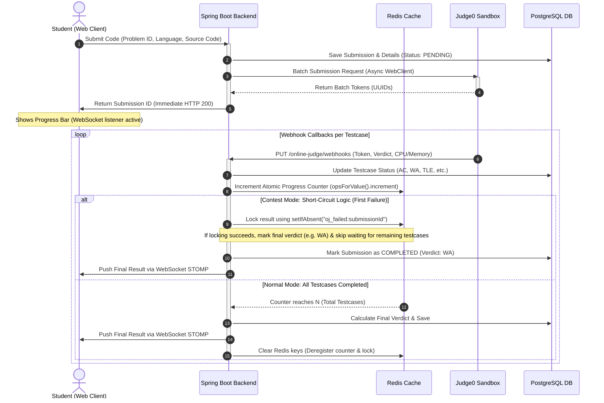

# Asynchronous Webhook-Driven Online Judge (OJ) Workflow

> CodeLearning Platform - Architecture Specification

This document specifies the technical architecture, non-blocking execution flow, concurrency control mechanisms, short-circuit evaluation algorithms, and real-time WebSocket distribution for the Online Judge (OJ) subsystem.

---

## 1. Architecture Overview

To support high concurrency and prevent blocking application threads during resource-intensive compilation and execution workloads, the evaluation pipeline is designed as an asynchronous, event-driven architecture:

```
+------------------+       HTTP POST        +-------------------------+       Batch Submit      +-------------------------+
|  Frontend Client | ---------------------> |   Spring Boot Backend   | ----------------------> |  Judge0 Sandbox Engine  |
|     (React 19)   | <--------------------- | (WebFlux, JPA, STOMP)   | <---------------------- | (Docker Sandbox v1.13)  |
+------------------+      Submission ID     +-------------------------+       Tokens (UUIDs)    +-------------------------+
         ^                                               |                                                   |
         |                                               | PUT Webhooks per testcase                         |
         | WebSocket STOMP                               v (Asynchronous callbacks)                          |
         +-----------------------------------------------+---------------------------------------------------+
```

### Core Technical Characteristics

| Component / Property | Technical Approach | Purpose and Operational Benefit |
| :--- | :--- | :--- |
| **Communication Model** | Asynchronous Webhook-based (Judge0 Batch API) | Eliminates client and server polling, reducing network overhead and idle compute usage. |
| **Asynchronous I/O** | Spring WebFlux `WebClient` | Non-blocking HTTP client dispatching multi-testcase payloads to the sandbox engine. |
| **Progress Coordination** | Redis Atomic Counter (`opsForValue().increment`) | Tracks completed testcase counts atomically, preventing race conditions among parallel callbacks. |
| **Contest Optimization** | Short-Circuit Evaluation (`Redis setIfAbsent`) | Concludes submission judgment immediately upon the first failed testcase during contests, saving sandbox compute. |
| **Real-time Updates** | WebSocket (STOMP over SockJS) | Streams per-testcase progress updates and final verdicts directly to client browsers without page refreshes. |

---

## 2. Sequence Diagram



---

## 3. Detailed Execution Phases

### Phase 1: Submission Ingestion and Initialization
1. **Client Submission Request**:
   - Endpoint: `POST /api/v1/online-judge/problems/{problemId}/submissions`
   - Payload: `languageId`, `sourceCode`, optional `lessonId` (for course practice), or optional `contestId` (for live competition).
2. **Initial Persistence (`PENDING`)**:
   - Creates a parent `OnlineJudgeSubmissionEntity` record with `PENDING` status.
   - Loads testcases for the target problem from `ProblemTestcaseEntity`.
   - Creates corresponding child `OnlineJudgeSubmissionDetailEntity` records for each testcase.

### Phase 2: Batch Dispatching to Judge0 Sandbox
1. **Batch Packaging**:
   - Formats testcase parameters into a batch submission payload:
     - Endpoint: `POST /submissions/batch?base64_encoded=false`
     - Configures `callback_url` pointing to the backend webhook receiver with embedded tracking tokens.
2. **Token Assignment and Client Response**:
   - Receives batch UUID tokens from Judge0.
   - Maps each token to its corresponding `OnlineJudgeSubmissionDetailEntity`.
   - Returns the `submissionId` to the frontend with an `HTTP 200/202` response. The client does not wait for code execution.

### Phase 3: Webhook Ingestion and Concurrency Management
As Judge0 finishes executing individual testcases inside isolated Docker containers, it posts execution metrics back to the backend:
- Endpoint: `PUT /api/v1/online-judge/webhooks/submissions`
- Payload: `token`, `status_id`, `time`, `memory`, `stdout`, `compile_output`.

Execution steps on webhook arrival:
1. **Detail Lookup**: Queries `OnlineJudgeSubmissionDetailEntity` using the callback `token`.
2. **Verdict Mapping**: Updates execution metrics (time, memory) and maps Judge0 status IDs to domain verdicts (`ACCEPTED`, `WRONG_ANSWER`, `TIME_LIMIT_EXCEEDED`, `MEMORY_LIMIT_EXCEEDED`, `COMPILATION_ERROR`).
3. **Atomic Counter Increment**:
   ```java
   String redisKey = "oj_progress:" + submissionId;
   Long processedCount = stringRedisTemplate.opsForValue().increment(redisKey);
   ```
   Because callbacks for distinct testcases arrive concurrently across multiple thread workers, using Redis `INCR` guarantees thread-safe, race-condition-free progress tracking.

### Phase 4: Short-Circuit Logic and Final Verdict Resolution

#### A. Contest Mode (Compute-Saving Short-Circuit)
In competitive programming contests, a non-accepted verdict on any testcase prevents the submission from earning full credit. To minimize computing cost:
1. When a testcase fails, the backend attempts to acquire an atomic Redis lock:
   ```java
   String failedKey = "oj_failed:" + submissionId;
   Boolean acquiredLock = stringRedisTemplate.opsForValue().setIfAbsent(failedKey, testcaseVerdict.name());
   ```
2. If `acquiredLock == true` (first detected failure):
   - Flags the submission as an **Early Finish**.
   - Persists the final failed verdict to the database (`submissionEntity.setVerdict(testcaseVerdict)`).
   - Sends a single consolidated message via WebSocket STOMP to the student.
   - Subsequent callbacks for this submission continue to update testcase details but do not trigger redundant WebSocket events.

#### B. Practice Mode (Course Learning)
1. For standard course practice, students observe real-time progress for each testcase (e.g., 3/10 testcases completed).
2. The backend sends progress updates to `/topic/submissions/{userId}` after each callback.
3. When `processedCount == totalTestcases`:
   - Inspects testcase records ordered by `order_index`. If all pass, the verdict is `ACCEPTED`; otherwise, the first encountered error determines the overall verdict.
   - Persists maximum execution time and peak memory consumption.
   - Pushes the final completion verdict via WebSocket.

### Phase 5: Resource Cleanup
Once all webhooks have arrived (`processedCount.equals(totalTestcases)`):
```java
stringRedisTemplate.delete("oj_progress:" + submissionId);
stringRedisTemplate.delete("oj_failed:" + submissionId);
```
This guarantees that keys are cleared from Redis memory regardless of whether the submission completed normally or was short-circuited.

---

## 4. Database Schema

```
+---------------------------------+           1:N          +----------------------------------------------+
|  online_judge_submissions       | ---------------------> |  online_judge_submission_details             |
+---------------------------------+                        +----------------------------------------------+
|  id                   (PK)      |                        |  id                   (PK)                   |
|  user_id              (FK)      |                        |  submission_id        (FK)                   |
|  problem_id           (FK)      |                        |  testcase_id          (FK)                   |
|  verdict              (VARCHAR) |                        |  judge0_token         (UUID, UNIQUE, INDEX)  |
|  execution_time_ms    (INTEGER) |                        |  verdict              (VARCHAR)              |
|  memory_used_kb       (INTEGER) |                        |  execution_time_ms    (INTEGER)              |
|  language_id          (INTEGER) |                        |  memory_used_kb       (INTEGER)              |
|  source_code          (TEXT)    |                        |  output               (TEXT)                 |
+---------------------------------+                        +----------------------------------------------+
```

---

## 5. Source Code References

* **REST Controller**: `com.thanhmila.codelearning.controller.oj.OnlineJudgeProblemController`
* **Service Implementation**: `com.thanhmila.codelearning.service.oj.OjSubmissionServiceImpl`
* **Judge0 Client Wrapper**: `com.thanhmila.codelearning.service.oj.Judge0ClientService`
* **WebSocket Configuration**: `com.thanhmila.codelearning.configuration.WebSocketConfig`
* **WebClient Configuration**: `com.thanhmila.codelearning.configuration.WebClientConfig`
* **JPA Repositories**:
  * `com.thanhmila.codelearning.repository.oj.OnlineJudgeSubmissionRepository`
  * `com.thanhmila.codelearning.repository.oj.OnlineJudgeSubmissionDetailRepository`
