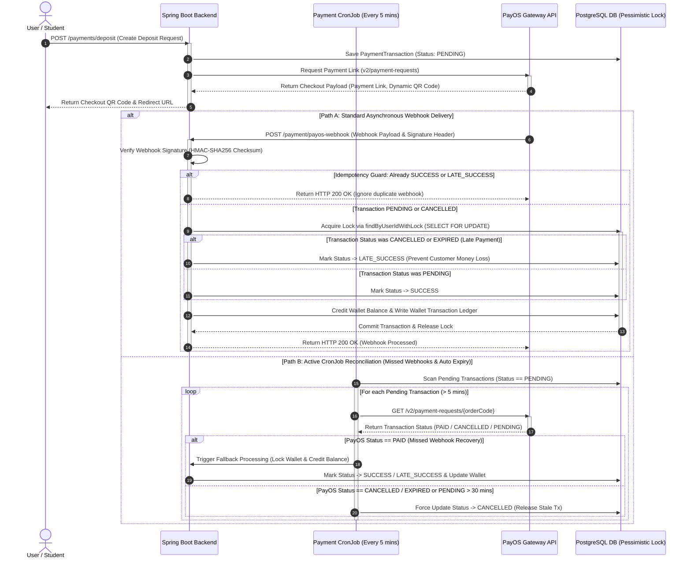

# Payment Gateway, Virtual Wallet, and Checkout Workflow

> CodeLearning Platform - Architecture Specification

This document specifies the financial architecture, dynamic VietQR deposit pipeline with PayOS, internal virtual wallet system, double-entry audit logging, concurrency control via PostgreSQL pessimistic locking (`SELECT FOR UPDATE`), late payment mitigation (`LATE_SUCCESS`), and scheduled reconciliation jobs.

---

## 1. Core Financial Principles

1. **Audit Trail and Double-Entry Ledger**:
   - The user balance column (`balance`) is never updated directly without generating an accompanying transaction record in the ledger table (`wallet_transactions`).
   - Every mutation records balance prior to update, change delta (+/-), resulting balance, timestamp, transaction classification, and order references.
2. **ACID Transactions and Concurrency Control**:
   - All balance additions and course purchase deductions are wrapped in `@Transactional`.
   - Uses PostgreSQL row-level pessimistic locking (`SELECT FOR UPDATE` via `findByUserIdWithLock`) to prevent race conditions during concurrent checkouts or parallel webhook arrivals.
3. **Late Payment Protection (`LATE_SUCCESS`)**:
   - When a student completes a bank transfer after an order has expired or transitioned to `CANCELLED`, the PayOS webhook is processed safely under `LATE_SUCCESS`. The system credits the internal wallet, preventing customer fund loss.
4. **Active CronJob Reconciliation**:
   - To guard against network failures or missed webhooks, a background scheduled task periodically queries PayOS API endpoints for stale `PENDING` transactions and syncs their final states.

---

## 2. Sequence Diagram



---

## 3. Detailed Workflows

### Workflow 1: Deposit Initiation via Dynamic VietQR
1. The user specifies a deposit amount (VND) on the web client.
2. The backend generates a `PaymentTransactionEntity` record:
   - `orderCode`: Unique numeric sequence identifier required by PayOS.
   - `amount`: Fiat currency amount (VND).
   - `status`: `PENDING`.
   - `wallet`: Associated user wallet entity.
3. The backend calls the PayOS API (`POST /v2/payment-requests`):
   - PayOS returns the hosted payment URL and the VietQR NAPAS247 specification payload.
4. The client renders the dynamic QR code pre-filled with the exact payment amount and memo content for instant bank scanning.

---

### Workflow 2: PayOS Webhook Processing (Path A - Real-time Webhook)
Upon successful transfer clearance, PayOS pushes a webhook callback:
- Endpoint: `POST /api/v1/payments/payos-webhook`
- Header: HMAC-SHA256 signature token.

#### Step 1: Cryptographic Signature Verification
The backend calculates the HMAC-SHA256 digest of the request payload using `PAYOS_CHECKSUM_KEY`. If the signature does not match, the request is immediately rejected (`400 Bad Request`), preventing forged credit attempts.

#### Step 2: Idempotency Guard
The system inspects the current state of `PaymentTransactionEntity`:
- If the status is already `SUCCESS` or `LATE_SUCCESS`, the callback is acknowledged with `HTTP 200 OK` without re-applying credits.

#### Step 3: Row Locking and Late Payment Handling
The service opens an isolated transaction and locks the wallet row:
```java
WalletEntity wallet = walletRepository.findByUserIdWithLock(userId)
    .orElseThrow(() -> new AppException(ErrorCode.WALLET_NOT_FOUND));
```
- **Normal Settlement (`status == PENDING`)**:
  - Updates transaction state to `SUCCESS`.
  - Credits the wallet: `wallet.setBalance(wallet.getBalance().add(amount))`.
  - Records a `WalletTransactionEntity` entry classified as `DEPOSIT`.
- **Late Settlement (`status == CANCELLED` or Expired)**:
  - If the transaction was previously marked as cancelled by a reconciliation timeout before funds were received, the state transitions to `LATE_SUCCESS`.
  - Funds are credited to the wallet, safeguarding the customer against lost deposits.

---

### Workflow 3: CronJob Reconciliation (Path B - Reconciliation)
To handle network partitions, dropped webhooks, or stale requests:
1. `PaymentCronJob` executes on a recurring schedule:
   ```java
   @Scheduled(cron = "0 */5 * * * *")
   public void reconcilePendingTransactions() { ... }
   ```
2. Queries all `PaymentTransactionEntity` entries remaining in `PENDING` status older than 5 minutes.
3. Queries PayOS directly (`GET /v2/payment-requests/{orderCode}`):
   - **If PayOS status is `PAID`**: Executes fallback crediting with pessimistic locking, updates transaction status to `SUCCESS` or `LATE_SUCCESS`, and credits the wallet balance.
   - **If PayOS status is `CANCELLED` or transaction age exceeds 30 minutes**: Updates the internal status to `CANCELLED` to terminate the stale checkout session.

---

### Workflow 4: Course Checkout and Wallet Deduction

```
+--------------+     POST /cart/checkout      +---------------------+     Lock & Deduct      +----------------------+
| User Browser | ---------------------------> | Spring Boot Backend | ---------------------> | PostgreSQL (Wallets) |
+--------------+                              +---------------------+                        +----------------------+
                                                         |                                               |
                                                         | Success: Create Enrollments                   |
                                                         v                                               |
                                              +---------------------+                                    |
                                              |     Enrollments     | <----------------------------------+
                                              +---------------------+
```

1. The user adds selected courses to the cart (`carts` and `cart_items`).
2. During checkout:
   - Validates cart contents and computes net pricing after applying active voucher codes.
   - Verifies sufficient wallet balance.
   - Invokes `findByUserIdWithLock` to acquire exclusive row ownership, deducts balance, and logs a `PURCHASE_COURSE` entry in `wallet_transactions`.
   - Persists corresponding `EnrollmentEntity` records for purchased courses.
   - Clears purchased items from the user cart.

---

## 4. Database Schema

```
+---------------------------------+           1:N          +----------------------------------------------+
|  wallets                        | ---------------------> |  wallet_transactions                         |
+---------------------------------+                        +----------------------------------------------+
|  id                   (PK)      |                        |  id                   (PK)                   |
|  user_id              (FK, UNQ) |                        |  wallet_id            (FK)                   |
|  balance              (NUMERIC) |                        |  amount               (NUMERIC)              |
|  status               (VARCHAR) |                        |  balance_after        (NUMERIC)              |
|  created_at           (TS)      |                        |  type                 (VARCHAR: DEPOSIT/...) |
|  updated_at           (TS)      |                        |  description          (TEXT)                 |
+---------------------------------+                        +----------------------------------------------+
         |
         | 1:N
         v
+----------------------------------------------+
|  payment_transactions                        |
+----------------------------------------------+
|  id                   (PK)                   |
|  wallet_id            (FK)                   |
|  order_code           (BIGINT, UNIQUE)       |
|  amount               (NUMERIC)              |
|  status               (PENDING/SUCCESS/...)  |
|  type                 (DEPOSIT/WITHDRAW)     |
|  payos_payment_link_id(VARCHAR)              |
|  created_at           (TIMESTAMP)            |
+----------------------------------------------+
```

---

## 5. Source Code References

* **Controllers**:
  * `com.thanhmila.codelearning.controller.payment.PaymentController`
  * `com.thanhmila.codelearning.controller.payment.CartController`
  * `com.thanhmila.codelearning.controller.payment.OrderController`
* **Service Implementations**:
  * `com.thanhmila.codelearning.service.payment.PaymentServiceImpl`
  * `com.thanhmila.codelearning.service.payment.WalletServiceImpl`
  * `com.thanhmila.codelearning.service.payment.CartServiceImpl`
  * `com.thanhmila.codelearning.service.payment.OrderServiceImpl`
  * `com.thanhmila.codelearning.service.payment.PayOsClient`
* **Cron Reconciliation**:
  * `com.thanhmila.codelearning.scheduler.PaymentCronJob`
* **Repositories**:
  * `com.thanhmila.codelearning.repository.payment.WalletRepository`
  * `com.thanhmila.codelearning.repository.payment.PaymentTransactionRepository`
  * `com.thanhmila.codelearning.repository.payment.WalletTransactionRepository`
