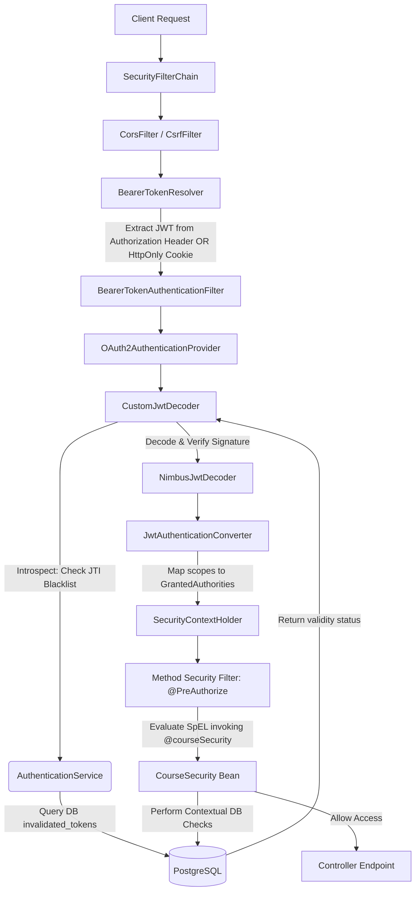
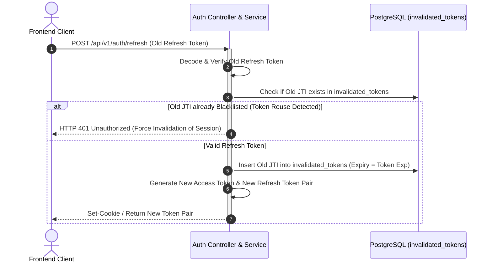

# Security Architecture and Dynamic Authorization Workflow

> CodeLearning Platform - Architecture Specification

This document details the security architecture of CodeLearning Platform, covering the **Spring Security OAuth2 Resource Server** configuration, the **Dual-Source Bearer Token Resolver**, **Refresh Token Rotation (RTR)**, token blacklisting via **JWT ID (JTI) introspection**, and **Contextual Method Security** evaluated using Spring Expression Language (SpEL).

---

## 1. Security Architecture Overview

The security subsystem enforces defense-in-depth measures against prevalent web application vulnerabilities (OWASP Top 10):
* **XSS and CSRF Mitigation**: Access tokens can be resolved dynamically from standard `Authorization` headers or encrypted, browser-managed `HttpOnly`, `SameSite` cookies.
* **Replay Attack Prevention**: Refresh Token Rotation (RTR) invalidates existing refresh tokens immediately upon issuing a replacement pair.
* **Instant Revocation**: Compromised or logged-out tokens are revoked prior to their standard JSON Web Token (JWT) expiration time via the `invalidated_tokens` table.
* **Contextual Access Control**: Access privileges (e.g., whether a student is enrolled in a specific course, or whether an instructor authored a problem) are validated directly at method boundaries via SpEL expressions.

---

## 2. Security Pipeline Flow



---

## 3. Technical Implementation Details

### 3.1. Dual-Source Bearer Token Resolver
Standard client architectures often force a compromise between storing JWTs in `localStorage` (vulnerable to XSS) or relying entirely on cookies. The system employs `CustomBearerTokenResolver` to provide flexible resolution:
1. **Header Inspection**: Checks for `Authorization: Bearer <token>`. When present, this header takes precedence (supporting mobile apps, CLI tools, automated testing, and server-to-server integrations).
2. **Cookie Fallback**: If no authorization header exists, the resolver inspects incoming request cookies for the designated secure cookie name (e.g., `access_token`). Because modern web browsers do not expose `HttpOnly` cookies to client-side scripts, JavaScript-based XSS attacks cannot extract credentials.

---

### 3.2. CustomJwtDecoder and Token Blacklisting (JTI Tracking)
Stateless JWT tokens are conventionally valid until their embedded expiration time (`exp`). To support immediate logout and token revocation:
1. Every issued JWT contains a unique UUID claim (`jti` - JWT ID).
2. `CustomJwtDecoder` intercepts the authentication process with a two-step validation:
   - **Step 1 (Blacklist Introspection)**: Queries the `invalidated_tokens` table using the extracted `jti`. If a match is found, authentication is rejected with an `UNAUTHENTICATED` error code.
   - **Step 2 (Cryptographic Signature Verification)**: Delegates token decoding to `NimbusJwtDecoder` using the configured symmetric HMAC key (`JWT_SIGNER_KEY`), verifying signature integrity and timestamp boundaries (`nbf`, `exp`).

---

### 3.3. Refresh Token Rotation (RTR) Workflow



* **Reuse Detection**: Each refresh token can be used exactly once. Issuing a new token pair simultaneously records the consumed refresh token's JTI in `invalidated_tokens`.
* **Automated Cleanup**: A scheduled job removes expired entries from `invalidated_tokens` whose `expiry_time` has elapsed, preventing unbound table growth.

---

### 3.4. Dynamic RBAC and Contextual Method Security (SpEL)
Access control combines static role assignments with contextual evaluations:
* **Assigned Roles**: `ROLE_STUDENT`, `ROLE_INSTRUCTOR`, `ROLE_ADMIN`.
* **Method-Level Security**: Enabled via `@EnableMethodSecurity`. Endpoints define authorization rules using dedicated security beans:

```java
// Verifies course enrollment or author ownership
@PreAuthorize("@courseSecurity.canAccessLesson(authentication, #lessonId)")
@GetMapping("/lessons/{lessonId}")
public ApiResponse<LessonResponse> getLesson(@PathVariable Long lessonId) { ... }

// Verifies problem author or admin privileges
@PreAuthorize("@problemSecurity.canModifyProblem(authentication, #problemId)")
@PutMapping("/problems/{problemId}")
public ApiResponse<ProblemResponse> updateProblem(...) { ... }
```

Security evaluators (`CourseSecurity`, `ContestSecurity`, `ProblemSecurity`) use native SQL `EXISTS` queries with indexed column checks to minimize query latency.

---

### 3.5. Google OAuth2 Single Sign-On (SSO)
* Accepts Google OAuth2 ID tokens via `POST /api/v1/auth/google`.
* Validates Google public certificates using `GoogleIdTokenVerifier`.
* Performs user synchronization (linking email, full name, avatar), auto-provisions a virtual wallet for new users, and returns a standard JWT token pair.

---

## 4. Database Schema

```
+--------------------------------------+
|  invalidated_tokens                  |
+--------------------------------------+
|  id                   (VARCHAR, PK)  |  <-- Revoked JTI UUID
|  expiry_time          (TIMESTAMP)    |  <-- Retained until token natural expiry
+--------------------------------------+

+--------------------------------------+           1:N          +--------------------------------------+
|  users                               | ---------------------> |  user_roles                          |
+--------------------------------------+                        +--------------------------------------+
|  id                   (BIGINT, PK)   |                        |  user_id              (FK)           |
|  email                (VARCHAR, UNQ) |                        |  role_name            (VARCHAR)      |
|  password_hash        (VARCHAR)      |                        +--------------------------------------+
|  full_name            (VARCHAR)      |
|  auth_provider        (LOCAL/GOOGLE) |
+--------------------------------------+
```

---

## 5. Source Code References

* **Security Configuration**: `com.thanhmila.codelearning.configuration.SecurityConfig`
* **JWT Decoder and Introspection**: `com.thanhmila.codelearning.security.CustomJwtDecoder`
* **Bearer Token Resolver**: `com.thanhmila.codelearning.security.CustomBearerTokenResolver`
* **Authentication Service**: `com.thanhmila.codelearning.service.auth.AuthenticationServiceImpl`
* **Contextual Security Evaluators**:
  * `com.thanhmila.codelearning.security.CourseSecurity`
  * `com.thanhmila.codelearning.security.ContestSecurity`
  * `com.thanhmila.codelearning.security.ProblemSecurity`
* **Repositories**:
  * `com.thanhmila.codelearning.repository.auth.InvalidatedTokenRepository`
  * `com.thanhmila.codelearning.repository.user.UserRepository`
