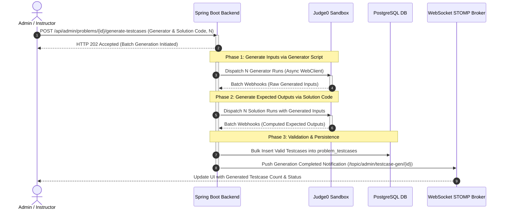

# Automated Testcase Generation Engine Workflow

> CodeLearning Platform - Architecture Specification

This document specifies the architecture and asynchronous workflow for **Automated Testcase Generation** using the **Judge0 Sandbox**. The subsystem enables instructors and administrators to provide input generator scripts and reference solution code to automatically synthesize $N$ input-output testcase pairs for programming problems.

---

## 1. Operational Context and Design Objectives

### Challenges in Manual Testcase Authoring
* **High Effort**: Manually drafting dozens of input-output datasets for complex algorithmic problems (large arrays, graphs, trees, or matrices) is time-consuming and error-prone.
* **Insufficient Edge-Case Coverage**: Handcrafted testcases frequently omit critical boundary conditions (zero values, negative numbers, large integers, empty inputs).
* **Output Discrepancies**: Manual calculations of expected outputs risk introducing inaccuracies, resulting in false `Wrong Answer` verdicts for correct student solutions.

### Automated Sandbox-Based Generation
Instructors provide two artifacts:
1. **Generator Code**: A script (e.g., Python) producing randomized inputs complying with problem constraints.
2. **Solution Code**: An optimal reference implementation (e.g., C++, Java, Python) that computes correct outputs for any valid input.

The engine coordinates with Judge0:
* Executes the generator script $N$ times $\rightarrow$ Captures $N$ distinct `input` strings.
* Feeds each generated `input` into the solution script $\rightarrow$ Captures $N$ corresponding `expectedOutput` strings.
* Batches and persists the validated `(input, expectedOutput)` pairs to the database and emits completion events over WebSockets.

---

## 2. Sequence Diagram



---

## 3. Execution Phases in Detail

### Phase 1: Request Ingestion and Immediate Acknowledgment
1. The instructor initiates the generation task from the problem administration view:
   - Endpoint: `POST /api/v1/admin/problems/{problemId}/generate-testcases`
   - Payload:
     ```json
     {
       "totalTestcasesToGenerate": 20,
       "generatorLanguageId": 71,
       "generatorCode": "import random\nn = random.randint(1, 1000)\nprint(n)\nprint(' '.join(str(random.randint(1, 10000)) for _ in range(n)))",
       "solutionLanguageId": 54,
       "solutionCode": "#include <iostream>\nusing namespace std;\nint main() { ... }"
     }
     ```
2. The service enforces permissions (`@PreAuthorize("hasAnyRole('ADMIN', 'INSTRUCTOR')")`), initializes an asynchronous task context, and responds immediately with `HTTP 202 Accepted`.

---

### Phase 2: Input Generation via Sandbox
1. Packages $N$ execution requests for `generatorCode` (with empty `stdin`).
2. Dispatches the batch to Judge0 via Spring WebFlux `WebClient`.
3. Processes Judge0 execution callbacks:
   - Collects `stdout` output streams representing synthetic testcase inputs.
   - Verifies process exit codes. If the generator crashes or produces syntax errors, execution aborts and an error notification is transmitted via WebSocket.

---

### Phase 3: Expected Output Computation via Sandbox
1. After collecting $N$ valid inputs:
2. Packages $N$ subsequent execution requests for `solutionCode`, mapping each synthesized input string into the corresponding request's `stdin`.
3. Dispatches the solution batch to the sandbox.
4. Processes output callbacks:
   - Captures `stdout` streams as authoritative `expectedOutput` values.
   - Asserts that the reference solution executes within configured time and memory constraints without runtime faults.

---

### Phase 4: Database Persistence and Real-Time Notification
1. Maps matching pairs into `ProblemTestcaseEntity` instances with sequential `orderIndex` assignments.
2. Executes a bulk insert into `problem_testcases`.
3. Emits a WebSocket notification to `/topic/admin/testcase-gen/{problemId}` indicating completion.
4. The client updates the testcase table dynamically without a page refresh.

---

## 4. Database Schema

```
+--------------------------------------+           1:N          +--------------------------------------+
|  online_judge_problems               | ---------------------> |  problem_testcases                   |
+--------------------------------------+                        +--------------------------------------+
|  id                   (BIGINT, PK)   |                        |  id                   (BIGINT, PK)   |
|  title                (VARCHAR)      |                        |  problem_id           (BIGINT, FK)   |
|  time_limit_ms        (INTEGER)      |                        |  input_data           (TEXT)         |
|  memory_limit_kb      (INTEGER)      |                        |  expected_output      (TEXT)         |
|  is_sample            (BOOLEAN)      |                        |  is_sample            (BOOLEAN)      |
|  created_by           (BIGINT, FK)   |                        |  order_index          (INTEGER)      |
+--------------------------------------+                        +--------------------------------------+
```

---

## 5. Source Code References

* **REST Controller**: `com.thanhmila.codelearning.controller.oj.AdminProblemController`
* **Service Implementation**: `com.thanhmila.codelearning.service.oj.TestcaseGenerationService`
* **Judge0 Client Wrapper**: `com.thanhmila.codelearning.service.oj.Judge0ClientService`
* **WebSocket Gateway**: `com.thanhmila.codelearning.configuration.WebSocketConfig`
* **JPA Repository**: `com.thanhmila.codelearning.repository.oj.ProblemTestcaseRepository`
