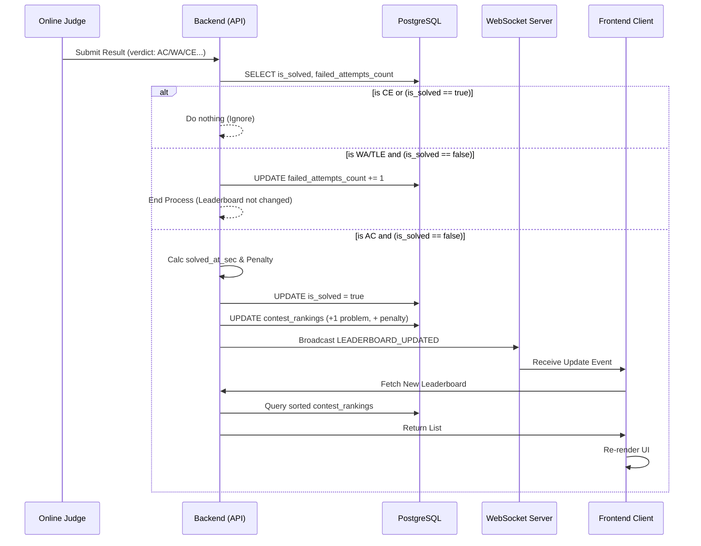

# Quy trình xử lý Bảng Xếp Hạng Trực Tiếp (Live Leaderboard Workflow - ICPC Standard)

Tài liệu này mô tả luồng xử lý (Workflow) chi tiết cho tính năng Bảng xếp hạng trực tiếp trong các kỳ thi lập trình (tuân theo luật ICPC). Luồng này được thiết kế thuần dựa trên CSDL PostgreSQL (không dùng Caching/Redis) và WebSocket để cập nhật thời gian thực.

## 1. Các bảng CSDL tham gia

- **`contest_problem_attempts`**: Bảng trạng thái chi tiết. Lưu lịch sử tóm tắt quá trình làm một bài toán của một thí sinh. Do có ràng buộc `UNIQUE(contest_id, user_id, problem_id)`, mỗi thí sinh chỉ có tối đa 1 dòng dữ liệu cho 1 bài tập.
- **`contest_rankings`**: Bảng tổng hợp. Lưu trữ sẵn thành tích tổng (`problems_solved` và `total_penalty`). Việc truy vấn bảng xếp hạng sẽ đọc trực tiếp từ bảng này.

---

## 2. Luồng xử lý chi tiết (Data Flow)

Luồng xử lý bắt đầu (Trigger) mỗi khi Hệ thống chấm điểm (Online Judge) chấm xong và trả về kết quả (Verdict) cho một lượt nộp bài của thí sinh.

Dữ liệu đầu vào từ Online Judge bao gồm:
- `contest_id`
- `user_id`
- `problem_id`
- `verdict` (AC, WA, TLE, CE...)
- `submit_time` (Thời điểm thí sinh ấn nút nộp bài)

### Bước 1: Lấy thông tin trạng thái bài toán
Hệ thống truy vấn DB để xem thí sinh này đã giải được bài này chưa và đã nộp sai bao nhiêu lần:
```sql
SELECT is_solved, failed_attempts_count 
FROM contest_problem_attempts 
WHERE contest_id = X AND user_id = Y AND problem_id = Z;
```

### Bước 2: Rẽ nhánh xử lý theo Verdict

#### 🔴 Trường hợp 2.1: Lỗi biên dịch (CE) hoặc Lỗi hệ thống máy chấm (Internal Error)
- **Luật ICPC**: Code bị CE tức là code không chạy được, chưa tiêu tốn tài nguyên chạy thử, do đó **không bị phạt**.
- **Hành động Backend**: Chỉ lưu lại log nộp bài (vào bảng submissions nếu có) và **BỎ QUA**, không cập nhật gì vào bảng attempts hay rankings.

#### 🟡 Trường hợp 2.2: Nộp Sai (WA, TLE, MLE, RTE...)
- Kiểm tra trạng thái hiện tại của `is_solved` lấy được ở Bước 1.
  - **Nếu `is_solved == true`**: Nghĩa là thí sinh đã giải đúng bài này ở các lần nộp trước rồi (giờ nộp lại nhưng bị sai). Theo luật, **BỎ QUA**, không bị cộng thêm penalty.
  - **Nếu `is_solved == false`**: Nghĩa là bài vẫn chưa được giải. Hệ thống phải ghi nhận lần nộp sai này bằng cách cộng thêm 1 vào `failed_attempts_count`.
    ```sql
    UPDATE contest_problem_attempts
    SET failed_attempts_count = failed_attempts_count + 1
    WHERE contest_id = X AND user_id = Y AND problem_id = Z;
    ```
- **Có cập nhật Bảng Xếp Hạng không?** -> **KHÔNG**. Thời gian phạt (Penalty) của lần nộp sai này chỉ được tính khi bài toán được giải đúng. Do vậy, bảng `contest_rankings` vẫn giữ nguyên. Không kích hoạt WebSocket.

#### 🟢 Trường hợp 2.3: Nộp Đúng (AC - Accepted)
- Kiểm tra trạng thái hiện tại của `is_solved`:
  - **Nếu `is_solved == true`**: Thí sinh nộp lại một bài đã AC. **BỎ QUA**.
  - **Nếu `is_solved == false`**: Đây là **lần nộp AC hợp lệ đầu tiên**. Tiến hành chuỗi hành động cập nhật điểm:

    **1. Tính thời gian làm bài (`solved_at_seconds`)**:
    `solved_at_seconds` = `submit_time` - `contest.start_time` *(Tính bằng giây)*

    **2. Cập nhật trạng thái bài toán**:
    ```sql
    UPDATE contest_problem_attempts
    SET is_solved = true, 
        solved_at_seconds = [solved_at_seconds]
    WHERE contest_id = X AND user_id = Y AND problem_id = Z;
    ```

    **3. Tính Tổng Penalty riêng cho bài toán này**:
    *Mỗi lần nộp sai trước đó (nếu có) bị phạt 20 phút (1200 giây).*
    `Penalty_Bài_Toán` = `solved_at_seconds` + (`failed_attempts_count` * 1200)

    **4. Cập nhật tổng thành tích vào Bảng Xếp Hạng (`contest_rankings`)**:
    ```sql
    UPDATE contest_rankings
    SET problems_solved = problems_solved + 1,
        total_penalty = total_penalty + [Penalty_Bài_Toán],
        updated_at = NOW()
    WHERE contest_id = X AND user_id = Y;
    ```

    **5. Phát tín hiệu qua WebSocket**:
    Lúc này thứ hạng của thí sinh đã thay đổi. Backend sẽ emit/broadcast một message qua WebSocket đến channel của kỳ thi đó (Ví dụ: phòng `contest_room_X`).
    Message Payload (tham khảo):
    ```json
    {
      "event": "LEADERBOARD_UPDATED",
      "contest_id": X,
      "user_id": Y
    }
    ```

---

## 3. Luồng xử lý phía Frontend (Realtime)

1. Khi người dùng (thí sinh/khán giả) vào trang kỳ thi, Frontend mở kết nối WebSocket và tham gia (subscribe) vào Room `contest_room_{id}`.
2. Khi giao diện nhận được sự kiện `LEADERBOARD_UPDATED` từ Server:
   - Cách dễ nhất (tuy hơi tốn tải DB): Frontend gọi lại Rest API `GET /api/contests/{id}/leaderboard` để tải mới hoàn toàn danh sách xếp hạng. API này sẽ query: `SELECT * FROM contest_rankings ORDER BY problems_solved DESC, total_penalty ASC`.
   - Cách tối ưu giao diện: Frontend render lại Animation hoán đổi vị trí của User Y lên cao hơn trong bảng để tạo hiệu ứng mượt mà.

---

## 4. Tóm tắt biểu đồ luồng (Sequence)


